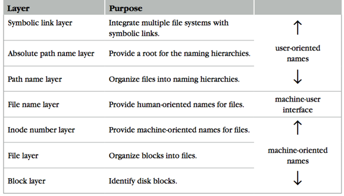
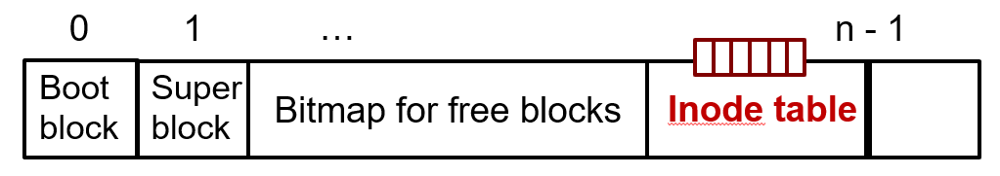
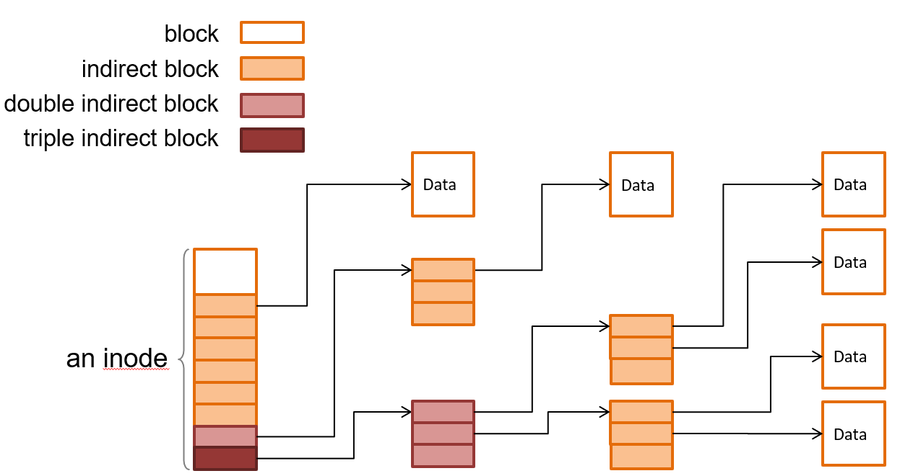
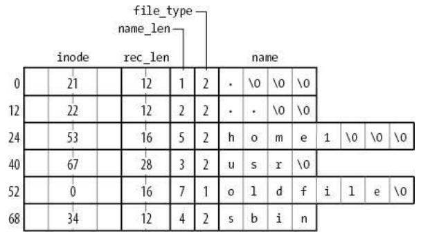
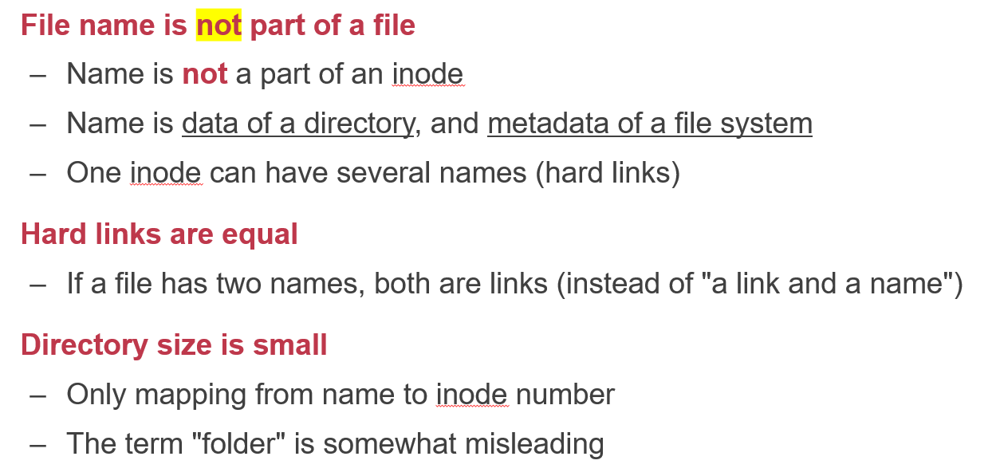

# CSE-labs
labs of CSE.

## Lab 1 Basic File System

### Inode structure

Like many other computer system, the inode-based file system is also abstracted into many different layers.



+ Block layer: 

  Mapping block_id to block. The structure of blocks are like this: 

  

  The **Super block** stores the metadata of size of the blocks, number of free blocks, etc.

  Using bitmap to map free blocks would improve efficiency. In my file system, I use a map called using_blocks to simply replace the bitmap.

  Following the bitmap, there are file blocks being composed of inode table(which will be mentioned later) and data blocks.

+ File Layer

  Inode table are composed of many inodes. Notice that inode itself is a block. A block may store many inodes, but in my file system, a block simply stores merely one inode. The basic structure of inode is like this:

  ```c++
  struct inode {
  	int inum; //inode number
  	char type; //file type: FILE? DIRECTORY? SYMLINK?
  	char blocks[NBLOCKS]; //NBLOCKS refers to the number of blocks it links to
  	int atime; //access time
  	int ctime; //mentioned later
  	int mtime; //modify time
  }
  ```

  The structure of inode table is very similar to page table, but they are a bit different. The indirect block will links to many direct blocks(stores the real data of files, while the indirect one itself is just like a directory, which only stores the block id of the blocks it links to.) Notice that the double indirect block will link to many indirect block, triple indirect block is the same. 

  In my file system, block size is set to 512 bytes(In file system block size is usually fixed.), and the block id's type is **unsigned int**, which will occupy 4 bytes. So an indirect block can link to 512 / 4 = 128 direct blocks. For double indirect block, the number of block it will link to is 128 * 128 direct blocks. 

  In my file system, there are 100 direct blocks and 1 indirect block. So a file will can at most store (100 + 128) * 512 B = 114MB (small but enough XD).




​	In this layer, an index of block in an inode can be simply transformed to block id. 

+ Inode number layer

  This layer is quite simple. Inode number is mapped to an inode. So once you get the inum, you can get the inode. Once you get the inode, you can simply access all the blocks of a certain file.

+ File name layer. 

  It's no way for a user to remember so many inode numbers. So a file name layer is very necessary.

  A file name layer maps the inode number to a name. Every file's name and its inode number are stored in the parent directory (It's different from the folder in windows). The directory is also a file. It stores the directory entry of files in it in its data blocks. Not like the folder in windows,  the size of directory in linux is only related to the number of entries and the length of the entry(related to the name of file).

  In ext3, the direct entry is like this:

  

  ```c++
  struct direntry {
      int inode_number;
      uint16_t entry_length;
      char name_length;
      char file_type;
      char* file_name;
  };
  ```

  The entry_length is variable. When an entry's next one has been removed, the entry_length will be simply expanded to  fill the "hole". When inserting a new entry, it can also insert into the "hole" and adjust the entry _length of adjacent entry. 

  But there are some corner cases: What if the previous entry is at max size, or the entry to unlink is the first entry? Anyway, it's still a very simple but powerful design.

  Notice that the file_name will be bounded up to the multiple of 4:

  

  You can use a macro to bound up:
  
  ```c++
  #define BOUND_UP(x) ((x + 3) & ~3)
  ```
  
  #### References:
  
  + [Lecture 12: Filesystems Continued](http://web.cs.ucla.edu/classes/winter16/cs111/scribe/12c/index.html)
  + [File systems ext2, ext3 and ext4](https://students.mimuw.edu.pl/ZSO/Wyklady/11_extXfs/extXfs_short.pdf)
  
  In my system, the attribute "type" is not necessary, so I deprecate it. 
  
  Actually "." and ".." are two directory entry. "." 's inode number is the same as current directory. ".." 's inode number is the inode number of the parent directory.

+ Path name layer:

  **LINK**: create shortcut for long names

  –LINK("Mail/inbox/new-assignment", "assignment")

  –Turns strict hierarchy into a directed graph

  –Users cannot create links to directories -> acyclic graph

  –Different filenames, same inode number

  **UNLINK**

  –Remove the binding of filename to inode number

  –If UNLINK last binding, put inode/blocks to a free-list

  –A reference counter is needed

  **Think about:** the atomic of rename?

+ Absolute path layer

  **Root directory:**

  –A universal context for all users

  –A well-known name: '/'

  –Both '/.' and '/..' are linked to '/'

So the perspective of all the layers are like this:

Root directory => ... => Parent directory => current directory => inode => blocks 

+ Symbolic link layer(Soft link)

  Name files **on other disks**

  –Inode is different on other disks

  –Supports to attach new disks to the name space

  **The target of symbolic link don't necessarily need to exist at present. It can be created in the future.**

  

### Annoying segmentation fault

+ Segmentation fault(core dumped):

  This will usually occur when we are trying to visit memory address that we haven't allocated yet. For example, if you allocate a array with SIZE.

  ```c++
  char array[SIZE];
  ```

  But you try to do this:

  ```c++
  memcpy(array, other, SIZE + n);
  ```

  It will probably cause segmentation fault.

+ sysmalloc: Assertion `(old_top == initial_top (av) && old_size == 0) ...

  That is because some illegal operations may cause the head or tail of the allocated space to be overwritten by other data, that is, the problem of memory out of bounds.
  
  For example, we may allocate a block with size of BLOCK_SIZE: 
  
  ```c++
  char *block = (char *) malloc(sizeof(char) * BLOCK_SIZE)
  ```
  
  But we are trying to do something like this: 
  
  ``` c++
  memcpy(block, other, 2 * BLOCK_SIZE);
  ```
  
  This may cause the problem above.
  
  
