# CSE期末复习

## Notice

+ 注意到数据库中提到的address应该是指偏移量之类的，而不是真实的物理地址。

## Database management system and Data model

### Relational Model

+ Constrain
+ NOT NULL
+ Delete cascade
+ Primary Key + tuple 对应于key-value（**The relational model is a superset of key-value** ）

#### SQL

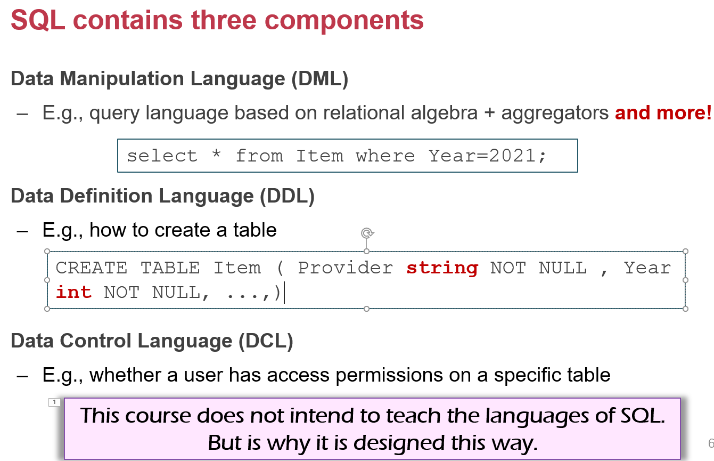

+ 查询顺序对效率影响比较大；

#### Summary

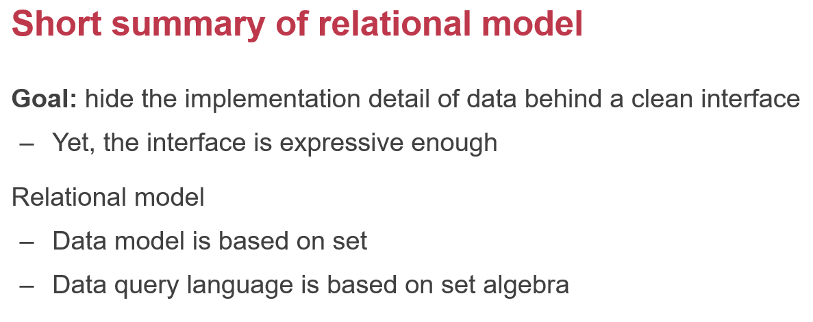

#### Many-to-one & One-to-many

+ Consistent style and spelling
+ Ambiguity (e.g., several cities with the same name)
+ Hard for updating. Suppose the city has changed its name 

+ 关系型数据库不适合one-to-many的数据结构。

### Document Model

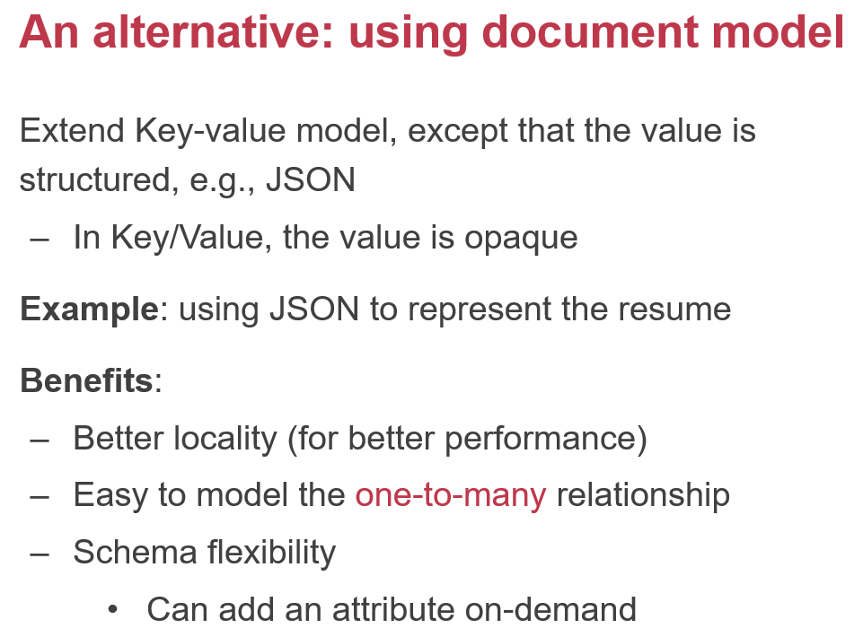

#### Better flexibility

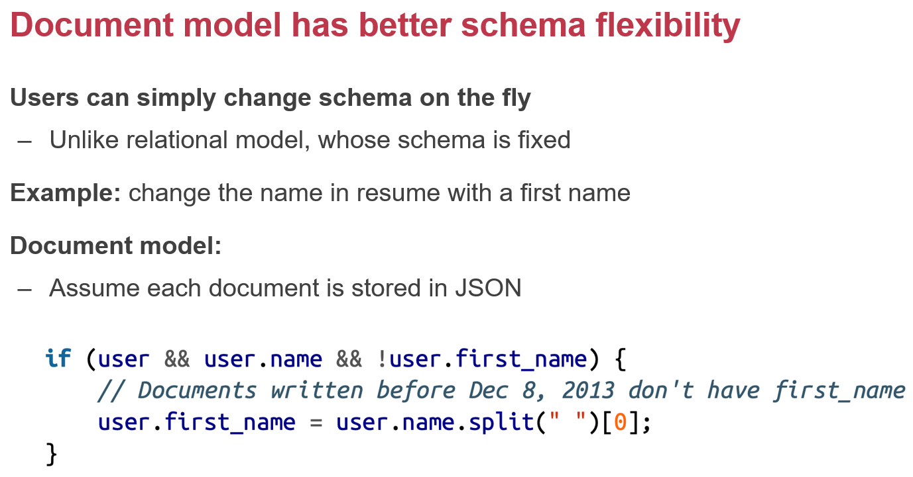

+ 如果关系型数据库需要修改schema的话，就必须要重建整张表。

#### Drawbacks

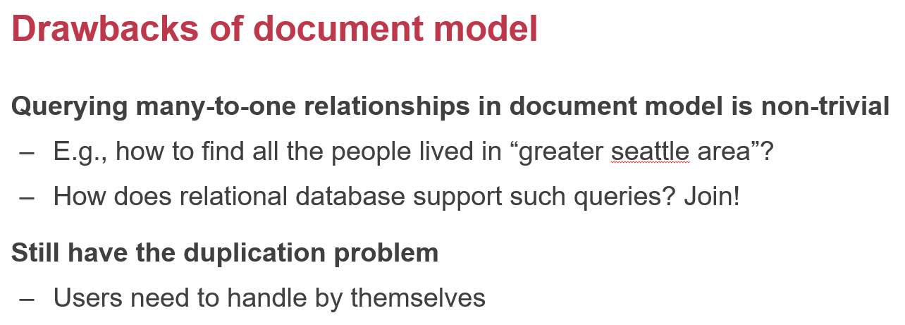

### Contrast

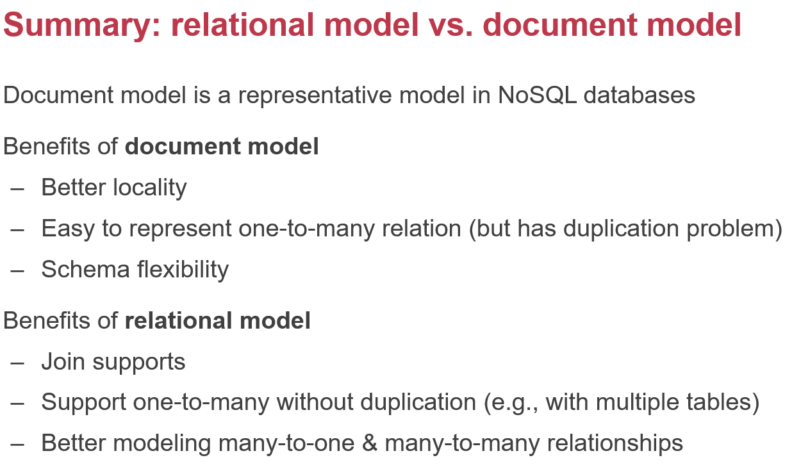

## DBMS Storage

#### Tuples

#### Page Size

如果page size太大可能无法支持原子性（还记得以前的lecture讲过用小电容实现原子性的方式。）

可以用WAL实现原子性！

#### HeapFile

DBMS使用heapfile存储pages。（用大文件组织，如果全是小文件每个都存metadata就会有很大overhead）

#### Storage of Tuples

Page is used to store B+Tree nodes

Deletion: 

\#1 may move many data to upon deletion

\#2.how to find the **empty tuple**? 

Slotted page解决了上面的问题。

使用offset的话进行插入或者删除只需要修改一个元素的offset即可。

#### Denormalize tuples

拆表可以减少空间占用（应对many-to-one的情况），但是会减少locality：必须要是用join操作。

可以通过prejoin提升一部分性能：

#### Cache

## Database management system and Buffer pool

#### Structure

Tuple被存放在page中，page采用slotted的方式。

+ Header中存放tuple的数量和最后一个使用的tuple的offset。
+ Tuple往前涨，Slot array往后涨，当两者相交的时候说明该页已经存满了。
+ 为什么不用index而是用这种方式？因为page一般比较小，使用index很浪费。而log-structed segment很大，因而很适合使用index。

#### Free pages

需要一个能找到free pages的数据结构：

    
    

page directory需要和data同步，要做到这一点可以使用log（journal），和文件系统是类似的。

#### Cache

为了加速，必须使用cache。而操作系统提供的cache是不可控的，所以：

大多数数据库会使用O_DIRECT避开OS的page cache

DB 尝试避开OS，因为cache的换页是不可控的(MMAP不可行)

DB 用自己的BUFFER POOL

> O_DIRECT (Since Linux 2.4.10)
>        Try to minimize cache effects of the I/O to and from this file.  In general this
>        will degrade performance, but it is useful in special situations, such  as  when
>        applications do their own caching.  File I/O is done directly to/from user space
>        buffers.  The I/O is synchronous, that is, at the completion  of  a  read(2)  or
>        write(2), data is guaranteed to have been transferred.  See NOTES below for 
>        further discussion.

一般如果在Linux内核中读写一个文件，其IO流程都需要经过Kernel内的page cache层次，若想要使用自己开发的缓存系统，那么就可以在打开这个文件的时候，对该文件加以O_DIRECT的标志位，这样一来就可以让程序对该文件的IO直接在磁盘上进行，从而避开了Kernel的page cache，进而对IO流程里的块数据进行拦截，让其流入到自己开发的缓存系统内。

#### BufferPool的结构

被写的page不会立刻被flush到硬盘，而是标上dirty bit表示已经被写了。只有dirty page才会被flush。使用batching来提升效率。

### Lock vs Latches

可能存在这样的情况：在evict一个frame的同时一个请求正好访问这个frame。那么这就涉及到了并发的问题。

+ 数据库的latch基本对应OS的锁。比如B+树的插入，显然可能会产生分裂等等复杂的变换。如果多个插入请求过来，则必须要上锁。而这个锁又和transaction需要的逻辑上的锁不同，这是底层的数据结构需要的锁。前者我们称之为lock，后者则是latch。

+ Latch 是物理上的锁 不影响用户 logical→lock

+ Latch保证读a的时候a的frame不会被踢掉。读完就放锁
+ 对于B+tree 而言 也要latch
+ Latch是处理internal data structure。对用户没有影响
+ Latch都是in memory
+ 锁(指lock)也可以consistent 加锁这件事可能在一些数据库里面也被计入到log 以便更好地恢复

#### Multiple Buffer Pool

+ 一般index会被经常访问，一个buffer pool容易被覆盖。

+ 单个buffer pool容易导致latch竞争。
+ 工业级的数据库都有这一属性。

#### Page Prefetching

+ OS的prefetch是基于物理存储的 而DBMS维护着自己的数据结构(B+Tree) 可以更好地prefetch；
+ OS的prefetch大小和DBMS很可能不匹配。

#### Scan Sharing

–Q1: select * from Items; 

–Q2: select AVG(Price) from Items; 

像如上的两个连续的查询，实际上都会扫描整张表，两者扫描的内容都是相同的。但是显然在Q1完成查询之后，Buffer Pool的内容对Q2不起作用（根据LRU，最前面的数据会被后面的数据覆盖，但是Q2会从最前面的数据开始）

Q1会等Q2完成p0 p1 p2，避免p0被无谓地踢出的情况

上面的这种情况非常常见 30%（据统计）

### Buffer Replacement Policies

**What are the goals of buffer replacements?** 

+ **High** Accuracy

+ **Quick** Speed
+ **Low** Meta-data overhead 

#### LRU

需要额外的metadata（比如队列用于维护最近访问的page的队列）；并且每次访问的时候都需要两次队列操作，第一是把page移出队列，然后再把page加入队列。影响访问速度。

#### Clock Algorithm

Clock Algorithm是对LRU的近似算法。

顺时针转一圈，如果遇到reference bit为1的就置为0，否则就evict该page。

#### **Problem of** **sequential flooding**

+ A query performs a sequential scan that reads every page
  + E.g., select * from Items; 

**This pollutes the buffer pool with pages that are read once and then never again**

+ In some workloads the most recently used page is the most unneeded page

像select *这种扫描整张表的语句会造成flooding，污染buffer pool

#### Possible Workarounds

##### LRU-K

+ 数据第一次被访问，加入到访问历史列表；
+ 如果数据在访问历史列表里后没有达到K次访问，则按照一定规则（FIFO，LRU）淘汰；
+ 当访问历史队列中的数据访问次数达到K次后，将数据索引从历史队列删除，将数据移到缓存队列中，并缓存此数据，缓存队列重新按照时间排序；
+ 缓存数据队列中被再次访问后，重新排序；
+ 需要淘汰数据时，淘汰缓存队列中排在末尾的数据，即：淘汰“倒数第K次访问离现在最久”的数据。

LRU-K具有LRU的优点，同时能够避免LRU的缺点，实际应用中LRU-2是综合各种因素后最优的选择，LRU-3或者更大的K值命中率会高，但适应性差，需要大量的数据访问才能将历史访问记录清除掉。

### BufferPool Bypass

### Query Execution Pattern

#### Priority hints

数据库可以使用query的模式优化对应的剔除/缓存 策略

point query（点查询），index的访问相对随机，顶层节点被访问概率更高，越往下越随机

应该缓存那些位于顶层的节点。

可以给buffer pool提供这些有用的信息。

#### **I/O cost of evicting a frame** 

+ **Problem #1. Slow** 
  + The DBMS must write back to disk to ensure that its changes are persisted 
+ **Problem #2. Consistency**
  + The log of the modified page is not persisted 

## Database management system Query execution & Summary

### Model of query plan

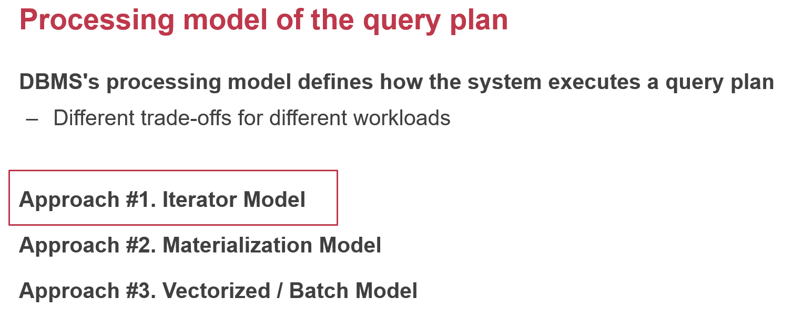

#### Iterator Model

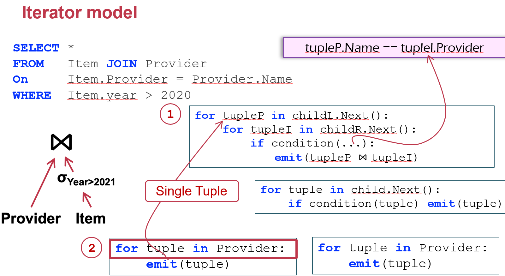

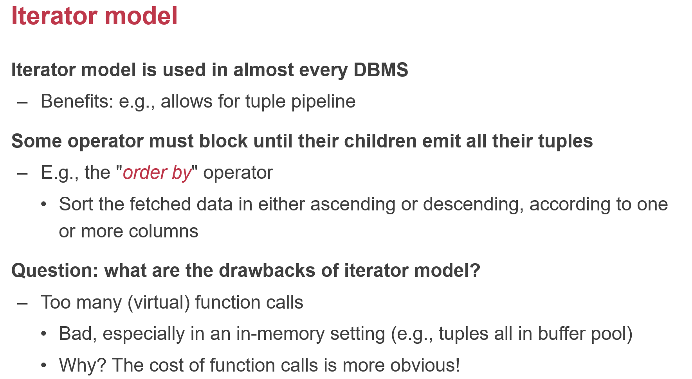

#### Materialization Model

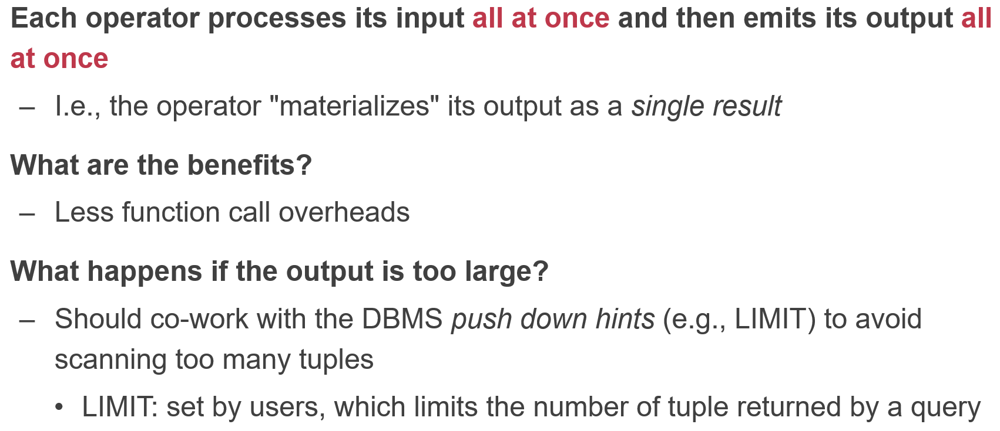

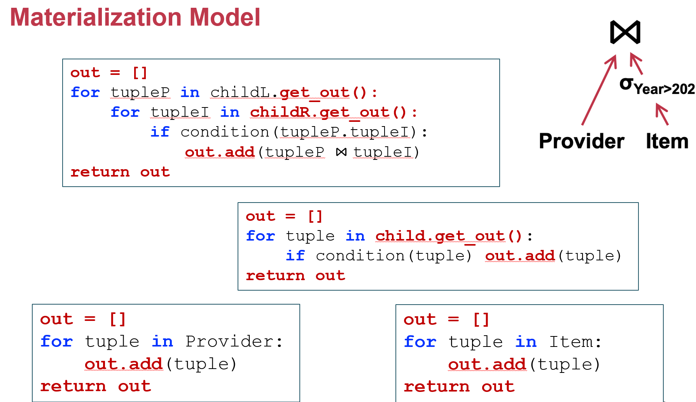

##### 优缺点

+ 适合OLTP，数量有限，效率高（不会像iterator model那样频繁地调用函数。）
+ 不适合OLAP，OLAP通常需要分析所有的数据。

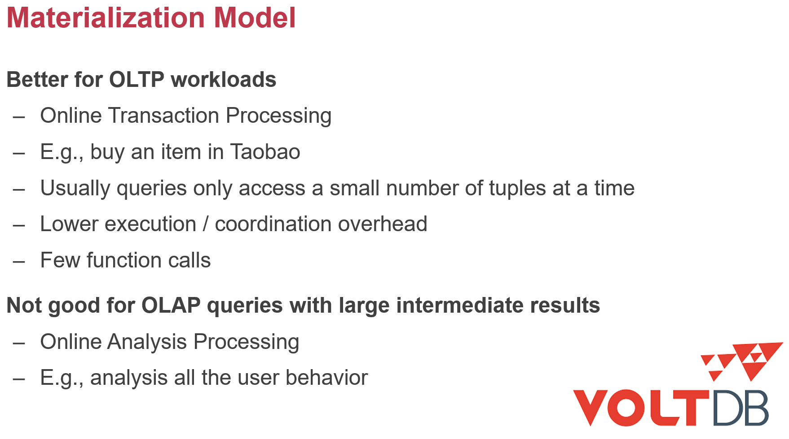

#### Vectorized Model

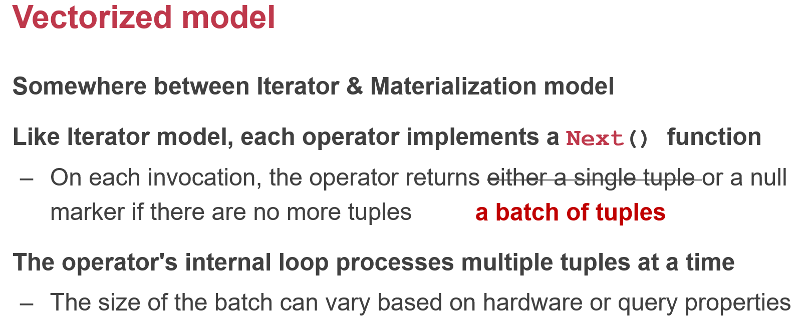

和iterator在逻辑上类似，但是返回的是一批数据而不是一个数据。

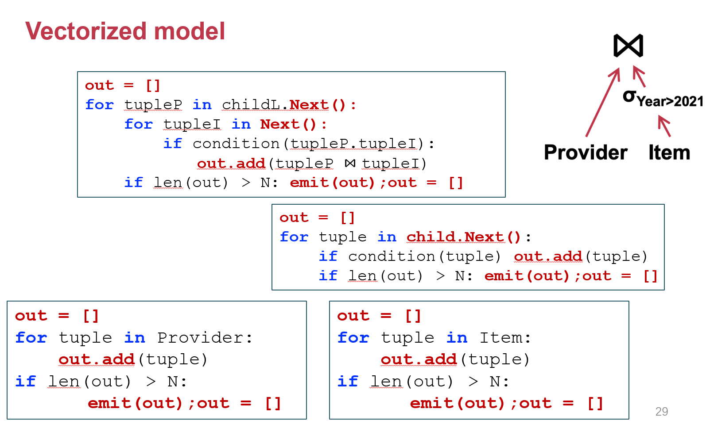

### Operator implementations & optimizations

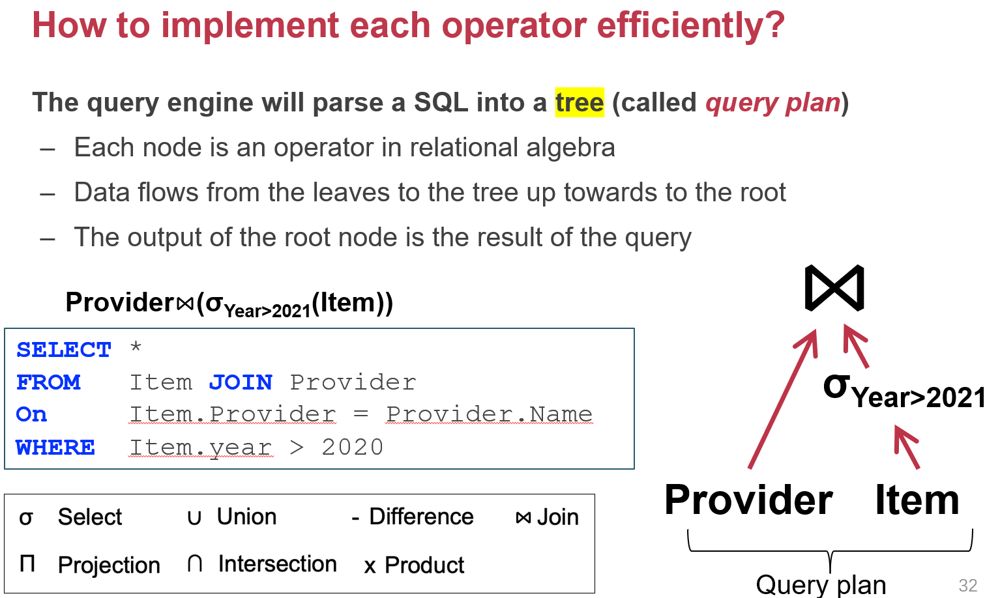

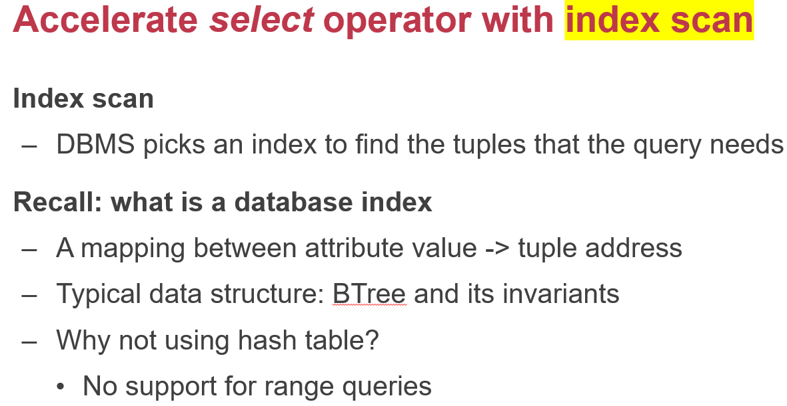

为了支持范围搜索，适用的是B+树而不是hash。

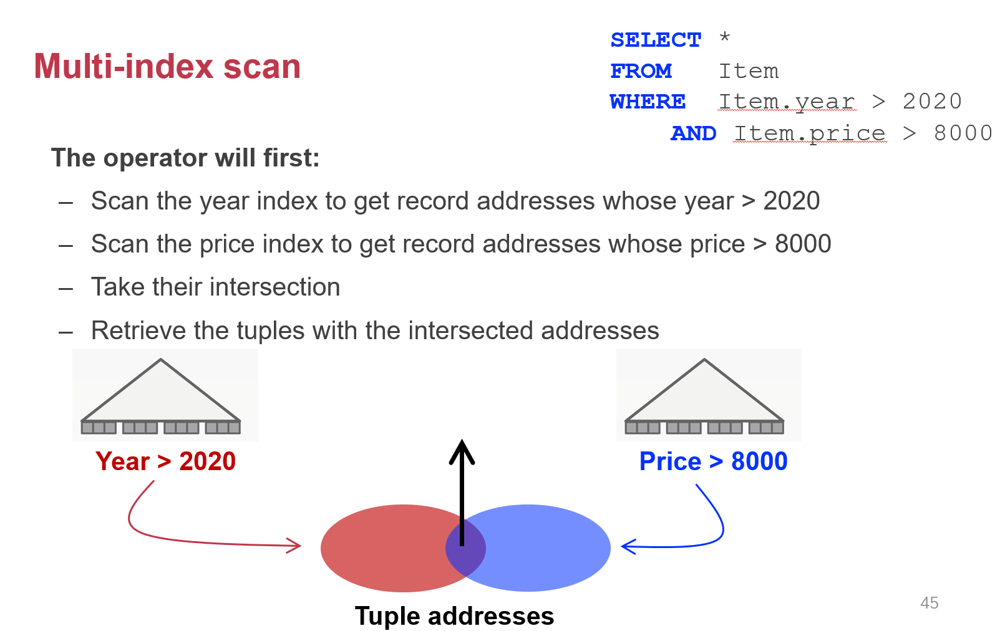

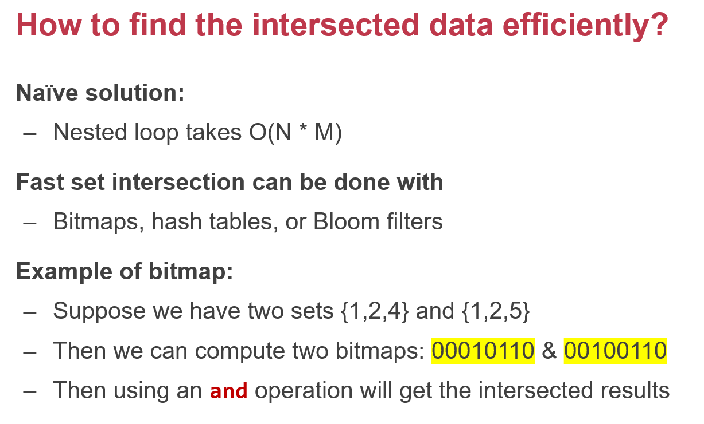

+ 注意到这里的multi-index应该是指多个index，而不是复合index。

#### Features

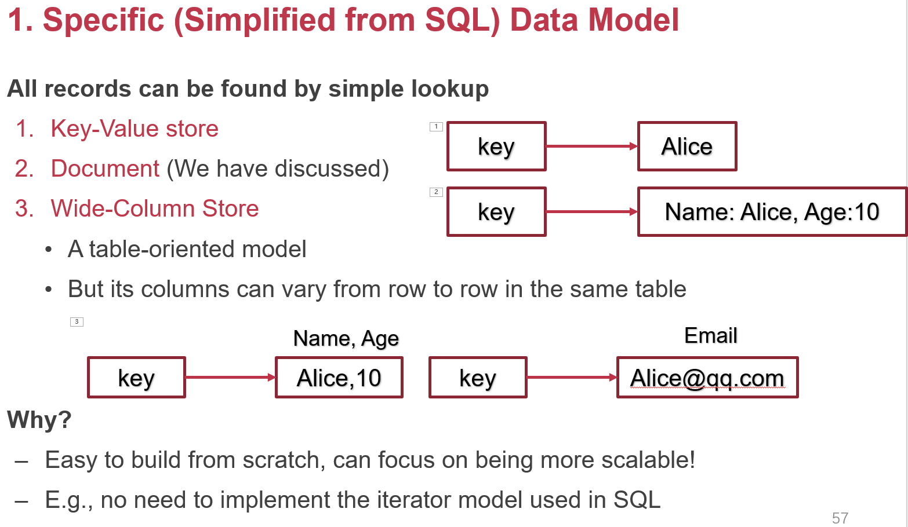

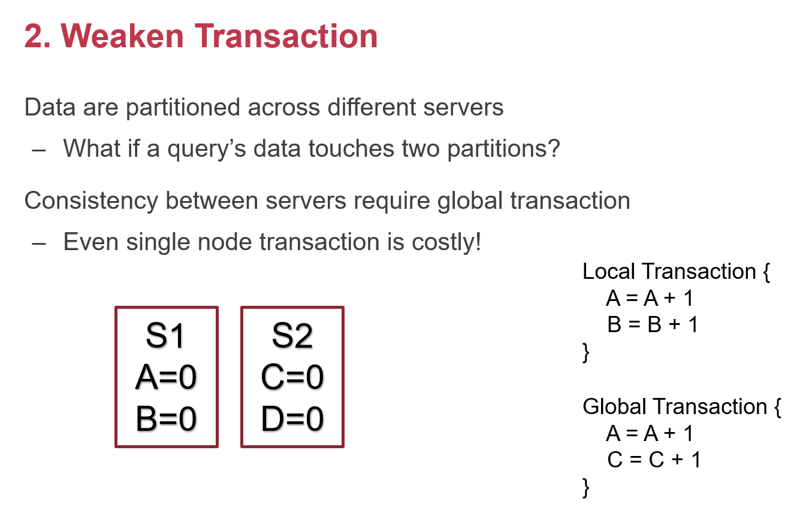

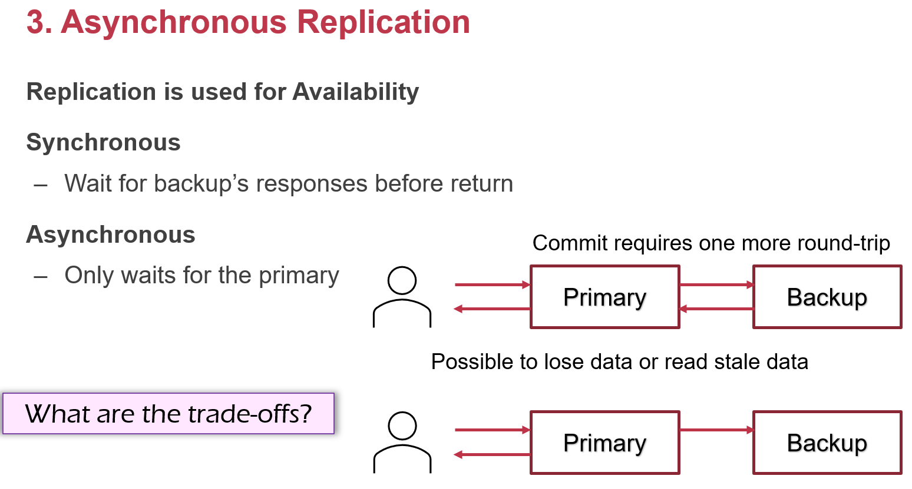

### Tikv

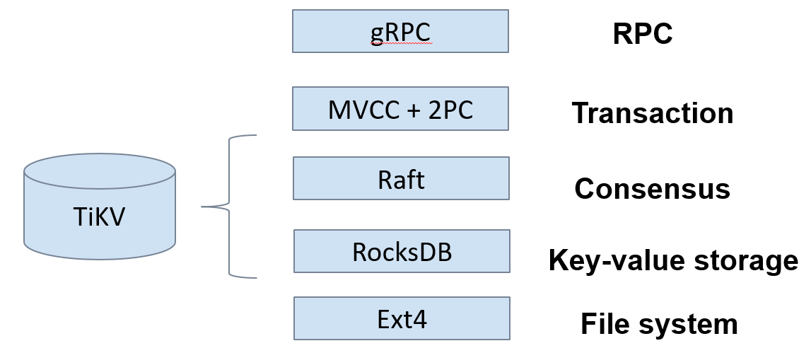

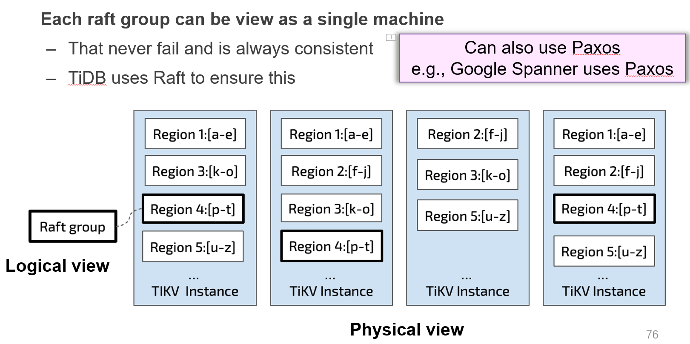

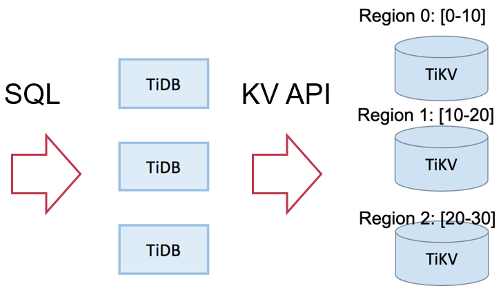

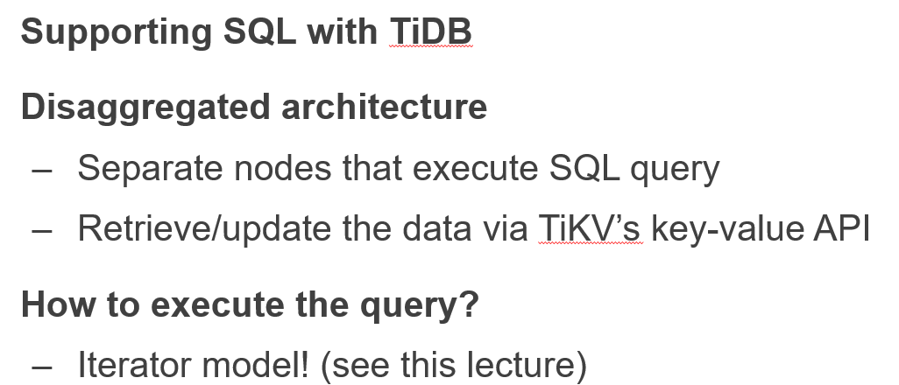

### Summary

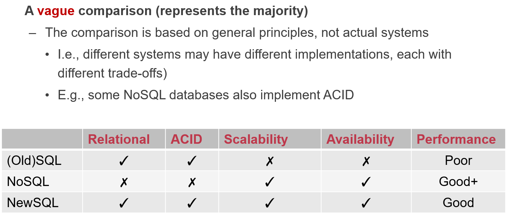
