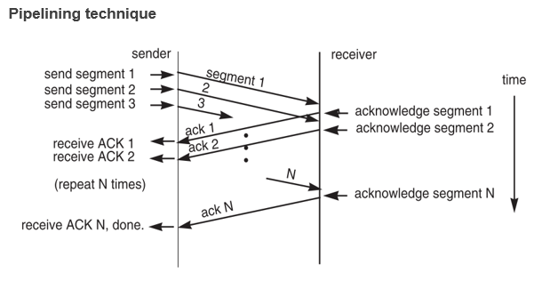
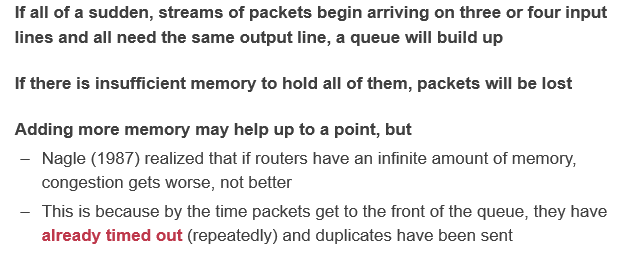
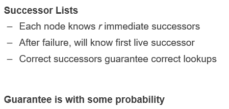

# CSE期末复习

## Notice

+ 注意到数据库中提到的address应该是指偏移量之类的，而不是真实的物理地址。

## Database management system and Data model

### Relational Model

+ Constrain
+ NOT NULL
+ Delete cascade
+ Primary Key + tuple 对应于key-value（**The relational model is a superset of key-value** ）

#### SQL

+ 查询顺序对效率影响比较大；

#### Summary

#### Many-to-one & One-to-many

+ Consistent style and spelling
+ Ambiguity (e.g., several cities with the same name)
+ Hard for updating. Suppose the city has changed its name 

+ 关系型数据库不适合one-to-many的数据结构。

### Document Model

#### Better flexibility

+ 如果关系型数据库需要修改schema的话，就必须要重建整张表。

#### Drawbacks

### Contrast

## DBMS Storage

#### Tuples

#### Page Size

如果page size太大可能无法支持原子性（还记得以前的lecture讲过用小电容实现原子性的方式。）

可以用WAL实现原子性！

#### HeapFile

DBMS使用heapfile存储pages。（用大文件组织，如果全是小文件每个都存metadata就会有很大overhead）

#### Storage of Tuples

Page is used to store B+Tree nodes

Deletion: 

\#1 may move many data to upon deletion

\#2.how to find the **empty tuple**? 

Slotted page解决了上面的问题。

使用offset的话进行插入或者删除只需要修改一个元素的offset即可。

#### Denormalize tuples

拆表可以减少空间占用（应对many-to-one的情况），但是会减少locality：必须要是用join操作。

可以通过prejoin提升一部分性能：

#### Cache

## Database management system and Buffer pool

#### Structure

Tuple被存放在page中，page采用slotted的方式。

+ Header中存放tuple的数量和最后一个使用的tuple的offset。
+ Tuple往前涨，Slot array往后涨，当两者相交的时候说明该页已经存满了。
+ 为什么不用index而是用这种方式？因为page一般比较小，使用index很浪费。而log-structed segment很大，因而很适合使用index。

#### Free pages

需要一个能找到free pages的数据结构：

    
    

page directory需要和data同步，要做到这一点可以使用log（journal），和文件系统是类似的。

#### Cache

为了加速，必须使用cache。而操作系统提供的cache是不可控的，所以：

大多数数据库会使用O_DIRECT避开OS的page cache

DB 尝试避开OS，因为cache的换页是不可控的(MMAP不可行)

DB 用自己的BUFFER POOL

> O_DIRECT (Since Linux 2.4.10)
>        Try to minimize cache effects of the I/O to and from this file.  In general this
>        will degrade performance, but it is useful in special situations, such  as  when
>        applications do their own caching.  File I/O is done directly to/from user space
>        buffers.  The I/O is synchronous, that is, at the completion  of  a  read(2)  or
>        write(2), data is guaranteed to have been transferred.  See NOTES below for 
>        further discussion.

一般如果在Linux内核中读写一个文件，其IO流程都需要经过Kernel内的page cache层次，若想要使用自己开发的缓存系统，那么就可以在打开这个文件的时候，对该文件加以O_DIRECT的标志位，这样一来就可以让程序对该文件的IO直接在磁盘上进行，从而避开了Kernel的page cache，进而对IO流程里的块数据进行拦截，让其流入到自己开发的缓存系统内。

#### BufferPool的结构

被写的page不会立刻被flush到硬盘，而是标上dirty bit表示已经被写了。只有dirty page才会被flush。使用batching来提升效率。

### Lock vs Latches

可能存在这样的情况：在evict一个frame的同时一个请求正好访问这个frame。那么这就涉及到了并发的问题。

+ 数据库的latch基本对应OS的锁。比如B+树的插入，显然可能会产生分裂等等复杂的变换。如果多个插入请求过来，则必须要上锁。而这个锁又和transaction需要的逻辑上的锁不同，这是底层的数据结构需要的锁。前者我们称之为lock，后者则是latch。

+ Latch 是物理上的锁 不影响用户 logical→lock

+ Latch保证读a的时候a的frame不会被踢掉。读完就放锁
+ 对于B+tree 而言 也要latch
+ Latch是处理internal data structure。对用户没有影响
+ Latch都是in memory
+ 锁(指lock)也可以consistent 加锁这件事可能在一些数据库里面也被计入到log 以便更好地恢复

#### Multiple Buffer Pool

+ 一般index会被经常访问，一个buffer pool容易被覆盖。

+ 单个buffer pool容易导致latch竞争。
+ 工业级的数据库都有这一属性。

#### Page Prefetching

+ OS的prefetch是基于物理存储的 而DBMS维护着自己的数据结构(B+Tree) 可以更好地prefetch；
+ OS的prefetch大小和DBMS很可能不匹配。

#### Scan Sharing

–Q1: select * from Items; 

–Q2: select AVG(Price) from Items; 

像如上的两个连续的查询，实际上都会扫描整张表，两者扫描的内容都是相同的。但是显然在Q1完成查询之后，Buffer Pool的内容对Q2不起作用（根据LRU，最前面的数据会被后面的数据覆盖，但是Q2会从最前面的数据开始）

Q1会等Q2完成p0 p1 p2，避免p0被无谓地踢出的情况

上面的这种情况非常常见 30%（据统计）

### Buffer Replacement Policies

**What are the goals of buffer replacements?** 

+ **High** Accuracy

+ **Quick** Speed
+ **Low** Meta-data overhead 

#### LRU

需要额外的metadata（比如队列用于维护最近访问的page的队列）；并且每次访问的时候都需要两次队列操作，第一是把page移出队列，然后再把page加入队列。影响访问速度。

#### Clock Algorithm

Clock Algorithm是对LRU的近似算法。

顺时针转一圈，如果遇到reference bit为1的就置为0，否则就evict该page。

#### **Problem of** **sequential flooding**

+ A query performs a sequential scan that reads every page
  + E.g., select * from Items; 

**This pollutes the buffer pool with pages that are read once and then never again**

+ In some workloads the most recently used page is the most unneeded page

像select *这种扫描整张表的语句会造成flooding，污染buffer pool

#### Possible Workarounds

##### LRU-K

+ 数据第一次被访问，加入到访问历史列表；
+ 如果数据在访问历史列表里后没有达到K次访问，则按照一定规则（FIFO，LRU）淘汰；
+ 当访问历史队列中的数据访问次数达到K次后，将数据索引从历史队列删除，将数据移到缓存队列中，并缓存此数据，缓存队列重新按照时间排序；
+ 缓存数据队列中被再次访问后，重新排序；
+ 需要淘汰数据时，淘汰缓存队列中排在末尾的数据，即：淘汰“倒数第K次访问离现在最久”的数据。

LRU-K具有LRU的优点，同时能够避免LRU的缺点，实际应用中LRU-2是综合各种因素后最优的选择，LRU-3或者更大的K值命中率会高，但适应性差，需要大量的数据访问才能将历史访问记录清除掉。

### BufferPool Bypass

### Query Execution Pattern

#### Priority hints

数据库可以使用query的模式优化对应的剔除/缓存 策略

point query（点查询），index的访问相对随机，顶层节点被访问概率更高，越往下越随机

应该缓存那些位于顶层的节点。

可以给buffer pool提供这些有用的信息。

#### **I/O cost of evicting a frame** 

+ **Problem #1. Slow** 
  + The DBMS must write back to disk to ensure that its changes are persisted 
+ **Problem #2. Consistency**
  + The log of the modified page is not persisted 

## Database management system Query execution & Summary

### Model of query plan

#### Iterator Model

#### Materialization Model

##### 优缺点

+ 适合OLTP，数量有限，效率高（不会像iterator model那样频繁地调用函数。）
+ 不适合OLAP，OLAP通常需要分析所有的数据。

#### Vectorized Model

和iterator在逻辑上类似，但是返回的是一批数据而不是一个数据。

### Operator implementations & optimizations

为了支持范围搜索，适用的是B+树而不是hash。

+ 注意到这里的multi-index应该是指多个index，而不是复合index。

#### Features

### Tikv

### Summary

## **Introduction to Network**

| Layer             | Entities                                                     | Namespace   | Protocols                  | What to care                     |
| ----------------- | ------------------------------------------------------------ | ----------- | -------------------------- | -------------------------------- |
| Application layer | Client and server; End-to-end connection                     | URL         | HTTP, FTP, POP3, SMTP, etc | Content of data: video, text...  |
| Transport layer   | Sender and receiver; Proxy, firewall, etc; End-to-end connection | port number | TCP, UDP, etc              | TCP: retransmit data if lost     |
| Network layer     | Gateway, bridge; Router, etc                                 | IP address  | IP, ICMP(ping)             | Next hop decided by route table. |

+ IP datagram

### Link Layer

+ 必须要等收到ack才能发下一条数据，至少为2△t

#### 周期同步

+ 可以使用VCO（利用锁相环）同步信号和自身的周期。
+ 但是如果都是0或者都是1怎么办（看不出周期来了）

+ Manchester Code:

  

  ### 电话

  每个用户在每5624 bit times里面占上8个bit，依次顺序并排。

### Network

### IP

现实中采用的是best-efforst这种方式。

#### Routing

+ Route Table

  

+ The Control-plane the table, data-plane *reads* the table

  

## Network Layer All about routing

### Routing

我们需要构建出这样的一张路由表，其中存储着距离目标最短的路径（比如说我要发送给dst，要保证cost最小那么我应该根据路由表转发给A）

#### Routing protocol

+ Link-state 告诉所有的节点自己到邻居的距离，使用dijkstra算法（计算单源最短路径）

  在advertisement中放入自己到其他邻居的距离，然后通flooding的方式传递下去（一传十， 十传百...）

下面这一块算法都是属于dijkstra的内容，即利用最短的边来松弛更多的边，把这些松弛过的边再纳入考虑范围（使用最小堆）

+ distance-vector routing 

  link state求得的是最短路径，但是对于一个网络节点而言，只需要知道下一个传输的节点是哪个就行了，没必要掌握整体的路径。这对于一个很大的网络系统是不可能实现的。

  在advertisement中存放的是一个节点知道的节点以及当前自己到这个节点的花费，初始值为[(self, 0)] 

  只会把advertisement发给自己的邻居，而不是flooding。

如果用上面这种方法可能会产生无限循环的问题。如果来了一个network parition， C对B而言是inf，但是A存储了之前到C的距离（1+1=2）。这时候A把advertisement发给B会导致B认为可以通过A到达C。但是A本身是通过B到达C的，这就会导致死循环。A<=>B。

解决这种情况的方法是记住额外的信息，A没有必要把C的距离信息发给B，因为A本身就是从B获知C的存在的。

从一端收到的路由信息，不能再从原路被发送回去。

A是从B认识的C 所以没有必要把C发给B

### Summary

| Method              | Pros                                  | Cons                                                         | Summary                          |
| ------------------- | ------------------------------------- | ------------------------------------------------------------ | -------------------------------- |
| **Link-State**      | Fast convergence                      | flooding is costly                                           | **Only good for small networks** |
| **Distance Vector** | Low overhead: 2x #Line advertisements | Convergence time is proportional to longest path; The infinity problem | **Only good for small networks** |

### Path Vector

类似于distance-vector，但是添加了新的结构。

### Hierarchical Routing

把一个个节点划分到一个region下面，这样forwarding table就不用记住所有的可到达节点，比如可以只记住R2，而不用记住R2下面所有的节点。这样就可以先通过link1到达R2，然后再转移到R2下面的某个节点。

同时也带来一部分缺点：如果更换位置与此同时地址也要改变。可能找到的不是最短路径。

### Topological Addressing

同一地区的ip地址是顺序的。所以可以使用子网掩码（和ip做and位运算，这里的24代表掩码是取前24位（0xffff....ff））

这样可以减少forwarding table的entry的数量，节省空间。同时减少advertisement的大小。

### Forwarding an IP Packet

不可以通过网卡发给自己，通过网卡的话就只能往外发。

转发代码位于kernel中，是否可以写一个用户态的转发？

轮询。

### NAT（Network Address Translation）

+ 为了解决网络IP不够的问题。
+ NAT网关，内网和外网连接的桥梁。

虽然破坏了层级（port是TCP上的概念），但是这在工程上的应用十分有效。

局限性，如果不用TCP怎么办？Port还能生效吗。

容量有限，如果连接特别多，这张表就会特别大，导致卡顿。

内网的设备访问外网，NAT为设备分配一个端口，加入一个相应的entry到表中。

可以绑定端口。

### Ethernet

当年没竞争过IP协议，沦为局域网协议。

Hub，一堆节点连接到hub上，共享；Switch星形。

可以broadcast一个包。收包之后往上层抛。

#### ARP协议

ARP ip adress to mac address

+ ARP和RARP完成 IP address和 MAC address之间的相互转换。

  

#### ARP Spoofing

由于ARP协议是等着别人告知自己ip地址。如果有人冒充告诉你一个假的地址怎么办？

本来是发给B的，结果发给了Hacker。

ARP广泛使用，很难更新，很难处理上述的问题。

解决方案：

+ 静态ARP表
+ 监听是否有人恶意操作

## End-to-end Layer

### At least once

+ Fixed timer不是一个好选择

+ **Adaptive timer**

  + E.g., adjust by currently observed RTT, set timer to 150% 

    设置为RTT的150%，但是注意到RTT在不断波动。

  + Exponential back-off: doubling from a small timer

    即1s， 2s， 4s...

+ **Linux code**

误判超时的情况非常常见。

+ **NAK (Negative AcKnowledgment)**

  + Receiver sends a message that lists missing items

  + Receiver can count arriving segments rather than timer

  + Sender can have no timer (only once per stream)

只发回没有收到的包，这样就能确定某些包没有被收到。

实际上还是要考虑很多丢包问题。

### At most once

注意，at most once需要维护额外信息（已经请求过了就不需要再做一次），更好的方法是使用幂等。

+ **Duplication Suppression**

+ 维护一个increasing number。拒绝比该number小的请求。

+ 或者使用新端口。
+ 现在老的nounce和port都不能删除，变成了tombstone。事实上要保证这一点必须要存储额外的信息。

要么存额外信息，要么约定好超过一定时间不再重试，删除相关信息。不管怎么样都会给系统带来一定的复杂度。

### Data integrity

使用checksum。

虽然网络连接层已经提供了hamming code（只能解决一位出错的情况），可以通过sender加入checksum，receiver验证checksum的方式来保证数据的完整性。但是该方法不能保证包不会被传输错地方。

### Segments and Reassembly of Long Messages

预留一个buffer，保存数据。

Sol2可能会导致buffer特别长。

Sol3解决了如上的问题。

### Jitter Control

最长-最短/平均

### Authenticity and Privacy

用公钥私钥的非对称加密交换一把对称的秘钥，然后仅仅使用这个秘钥进行通信，对称加密。

发包速度与信息传输的稳定性是一个tradeoff。

如上的方式能够保证准确性，但是效率不是很高，大量的时间都在等待ACK。

使用流水线的方，不停地收发。发包和收包无关，这是太快的情况，会导致大量丢包。

+ Fixed window

把发单个转换为一次发多个。上面的情况是window size为3的情况。等三个包都ACK了，再发下一组。但是这种情况存在一段时间的idle，可以优化：使用**滑动窗口**！

并不是等三个都收到再发下一组，而是受到一个ACK的时候就马上发下一个包，即移动滑动窗口一位。

但是可能会出现如下的情况，因为一直没有收到2的ACK，导致窗口“卡”住了。TCP为了尽快解决这种问题，使用了duplicate ACK的方式（一直发同样的ACK，sender可以从中发现某些包发生了丢包）

#### Tradeoff

#### Sliding Window Size

保证尽可能多包在传输过程中。RTT正好是发送第一个包到第一个包ACK的时间，在此期间都可以发包，最多可以发RTT*Data rate个包。这样第一个包ACK的时候窗口就可以右移一位，发送新的一个包。

Receiver Sender相互制约。

#### Congestion

一个更大的buffer并不能解决问题，反而可能会让问题更糟。

#### 修改Window Size

线性增长，指数下降。

存在的问题：一开始线性增长过于缓慢。"slow start"一开始以指数级增长。

检测到duplicate ack就减少一半， timeout直接window size清零，slow start again。

数据中心会保证这个锯齿在一个水平线来回震荡（积分一下面积更大。）

对于如下的情况，如果两个sender的window size相加大于10，那么就可能会导致拥塞。下面证明TCP是公平的。

对于局域网这种场景，容易出现信号不好，这时候应该加大window size才对；对于数据中心而言并不是很友好。DCTCP

## The Design of DNS

需要有一些nameservers去提供name service。肯定不能都放在一台服务器上。

### DNS hierarchy

root只会管下面这几个domain，这些domain很少变化（不然撑不住）；

通过这种组织方式很好地进行了分工，避免了某个节点成为瓶颈。

从root开始查找。对于domain而言是反过来的。

### 优化

如果所有人的look都直接去问root， root肯定会挂。应该能够去问任何的DNS server。(拿到IP的时候会分配一个DNS)

递归搜索。DNS服务器会去做递归。DNS服务器速度会快一点，并且有缓存。

假如cache是24小时，那么如果要更换IP，必须要把旧的IP保留24小时，把访问旧IP的全部重定向到新IP。24小时后旧的IP的cache就都过期了。

内外网都需要DNS 内网映射到内网ip 外网映射外网IP

ISP 互联网服务提供商

### Behind the DNS

#### Good points

去中心化。

#### Bad points

DoS，不断cache miss（找一个不存在的东西）

attacker让大量流量发送到某台机器上。

Only part of the zones are using DNSSEC, e.g., **.*gov***, ***.org***

## Decentralized Systems: CDN & P2P

### CDN(Content Distribution Network)

CDN对用户透明，主动分发数据。

Client需要两次connect，很耗时。

DNS有cache，第二次访问基本没有overhead。

多中心 中心化的控制面 去中心化的数据面 对用户而言是去中心化的。

数据部署在cluster中

+ client去服务器要一张图片（一般大厂都会买各个地区的CDN，加快访问速度），一般不会给服务器自己的图片地址，而是会给一个cdn的地址，cachexxxx
+ client拿到这个域名，去找DNS要，DNS递归找找找，找到Akamai的DNS服务器（DNS也可以只做名字和名字的映射（即alias，别名）），一路转发到真的地址——一台靠近client的，位于Akamai cluster中的机器。
+ 所以CDN是基于DNS的。

### P2P

+ 中心化的弊端：

通过中心化的方式拿到torrent文件，之后的事情就是去中心化的了。

Tracker记录谁拥有文件的某个部分；

Seeder就是拥有文件的人；

Peer一旦拥有完整的文件就会变成seeder。

就像播种一样传播开来，seeder会越来越多。（peer从最靠近的地方下载seeder的文件，然后自己变成seeder依次循环）

Tracker是中心化的，告诉用户种子的list。（这将会成为瓶颈）

Strict：按照严格的顺序下载；

Rarest First：拥有人数少的先下载；

默认的策略：第一个随机下；之后选择rarest的下；

**torrent**文件对应于一个**tracker**，也就是说我们拿到这个种子文件之后就能找到**tracker**，再根据**tracker**提供的信息找到**seeder**，把**seeder**用有的文件都下载下来最后拼接成一个完整的文件。

#### 弊端

注意到，上面的方式依旧存在中心化的因素：Tracker成为了瓶颈！

如何解决：使用分布式哈希表。把tracker的表的存储也分布式存储。

把hash表分布式存储，避免一个节点成为bottletneck。

#### Chord

##### Finger table

增加存储空间 O(1)(1 successor) =>O(logn) 记住1/2 ¼ 1/8…… 

以空间换时间，通过logn的时间复杂度找到对应的节点。

万一fingertable上的节点fail了怎么办？保存一个successor list尽量避免这种情况下的错误。

##### 一致性hash

节点fail的问题：

最多只会有一个节点需要进行数据的迁移。

K30 分给 N36 N25的successor转而指向N36

##### 虚拟节点

+ 一台物理机 分为若干个虚拟节点

+ 虚拟节点让负载更加均匀。

+ 增加虚拟节点以分配更多的负载 动态调整负载（如果一个机器的负载一直比较小（大），那么可以动态地增加（减少）虚拟节点的数量）

+ 让hot的节点平摊到物理节点上。总而言之就是让负载更加均衡。 

### Bitcoin

+ Hash 值必须保证前100位为0（这个100是可以调节的，随着算力增长而变大，始终保证大约10分钟出一个区块） 需要花大量时间获取随机数保证这一点——Proof of work
+ 每10分钟出一个block

必须要做到不可篡改。

矿工把鉴定为合法的交易记录积累到block里，当block到达一定的规模就把block连到区块链里（存一个地址（把前面的block算一个hash值）链接上一个block），全球就一个chain。一旦篡改，hash就会变，下一个block就不会指向自己，所以保证了不会被篡改。

如果block太多了，就会导致一台机器存不下block chain。这样的话掌握全貌的人就会是一台data center！注意，那可是中心化的，和bitcoin的理念背道而驰。

只有最长的链才会“赢”

只要修改一个就会导致后面的全部都需要修改，仿佛多米诺骨牌一般，这就大大加大了篡改的难度。

由掌握51%的人创建一个新的链？删掉一个区块然后迅速算一个chain，这样还是能够赢过其他人。根据比特币的协议，只会选择最长的链（同一时刻有很多的链（因为很多人在挖矿））

+ 比特币持有者拥有私钥，其他人必须拿到私钥才能进行交易；
+ 如果私钥丢了，那就没办法了；
+ 不会通货膨胀；而会通货紧缩。总有人会丢弃比特币，只会越来越少。
+ 是否是decentralized？不能算是完全去中心化。75%算力在中国（2019）
+ 是否需要PoW？浪费能源。但是用其他方法可能会带来风险。
+ 国内ban了，别想了

区块里存储着一块空间，可以存一段脚本。

智能合约，不需要中心的法规合同？

相信则有价值；需要一个分布式的分类账簿。

                                                                                                                                                                                                                                                                                                                                                                                                                                                                                                                                                                                                                                                                                                                                                                                                                                                                                                                                                                                                                                                                                                                                                                                                                                                                                                           

中国拥有75%的算力，让bitcoin失信？
