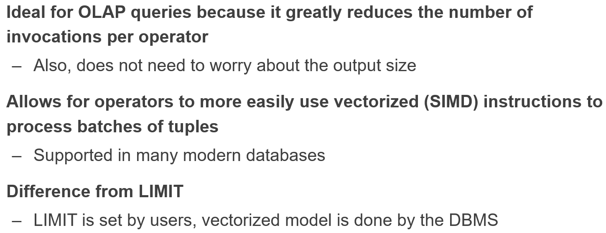
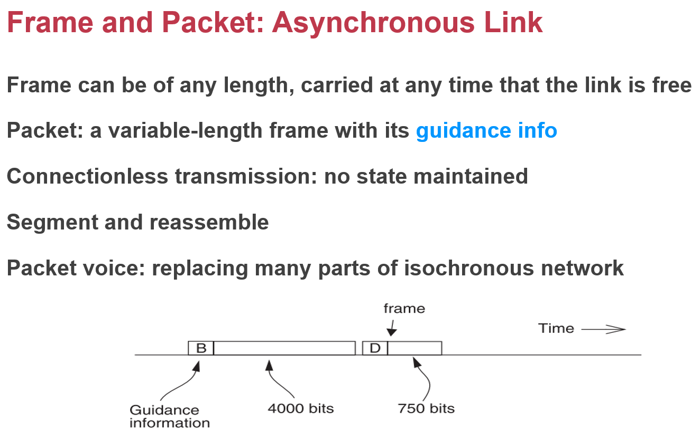
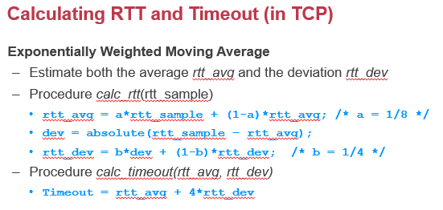
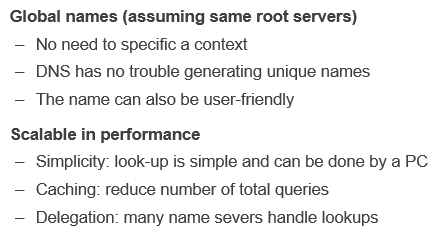
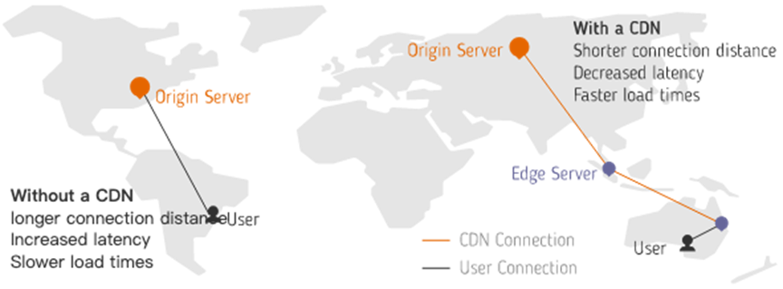

CSE期末复习

## 特别鸣谢

感谢[鲍神](https://github.com/Kami-code)提供的十万字笔记，书店没你的书我不去。

## Notice

+ 注意到数据库中提到的address应该是指偏移量之类的，而不是真实的物理地址。

## Database management system and Data model

### Relational Model

+ Constrain
+ NOT NULL
+ Delete cascade
+ Primary Key + tuple 对应于key-value（**The relational model is a superset of key-value** ）

#### SQL

+ 查询顺序对效率影响比较大；

#### Summary

#### Many-to-one & One-to-many

+ Consistent style and spelling
+ Ambiguity (e.g., several cities with the same name)
+ Hard for updating. Suppose the city has changed its name 

+ 关系型数据库不适合one-to-many的数据结构。

### Document Model

#### Better flexibility

+ 如果关系型数据库需要修改schema的话，就必须要重建整张表。

#### Drawbacks

### Contrast

## DBMS Storage

#### Tuples

#### Page Size

如果page size太大可能无法支持原子性（还记得以前的lecture讲过用小电容实现原子性的方式。）

可以用WAL实现原子性！

#### HeapFile

DBMS使用heapfile存储pages。（用大文件组织，如果全是小文件每个都存metadata就会有很大overhead）

#### Storage of Tuples

Page is used to store B+Tree nodes

Deletion: 

\#1 may move many data to upon deletion

\#2.how to find the **empty tuple**? 

Slotted page解决了上面的问题。

使用offset的话进行插入或者删除只需要修改一个元素的offset即可。

#### Denormalize tuples

拆表可以减少空间占用（应对many-to-one的情况），但是会减少locality：必须要是用join操作。

可以通过prejoin提升一部分性能：

#### Cache

## Database management system and Buffer pool

#### Structure

Tuple被存放在page中，page采用slotted的方式。

+ Header中存放tuple的数量和最后一个使用的tuple的offset。
+ Tuple往前涨，Slot array往后涨，当两者相交的时候说明该页已经存满了。
+ 为什么不用index而是用这种方式？因为page一般比较小，使用index很浪费。而log-structed segment很大，因而很适合使用index。

#### Free pages

需要一个能找到free pages的数据结构：

    
    

page directory需要和data同步，要做到这一点可以使用log（journal），和文件系统是类似的。

#### Cache

为了加速，必须使用cache。而操作系统提供的cache是不可控的，所以：

大多数数据库会使用O_DIRECT避开OS的page cache

DB 尝试避开OS，因为cache的换页是不可控的(MMAP不可行)

DB 用自己的BUFFER POOL

> O_DIRECT (Since Linux 2.4.10)
>        Try to minimize cache effects of the I/O to and from this file.  In general this
>        will degrade performance, but it is useful in special situations, such  as  when
>        applications do their own caching.  File I/O is done directly to/from user space
>        buffers.  The I/O is synchronous, that is, at the completion  of  a  read(2)  or
>        write(2), data is guaranteed to have been transferred.  See NOTES below for 
>        further discussion.

一般如果在Linux内核中读写一个文件，其IO流程都需要经过Kernel内的page cache层次，若想要使用自己开发的缓存系统，那么就可以在打开这个文件的时候，对该文件加以O_DIRECT的标志位，这样一来就可以让程序对该文件的IO直接在磁盘上进行，从而避开了Kernel的page cache，进而对IO流程里的块数据进行拦截，让其流入到自己开发的缓存系统内。

#### BufferPool的结构

被写的page不会立刻被flush到硬盘，而是标上dirty bit表示已经被写了。只有dirty page才会被flush。使用batching来提升效率。

### Lock vs Latches

可能存在这样的情况：在evict一个frame的同时一个请求正好访问这个frame。那么这就涉及到了并发的问题。

+ 数据库的latch基本对应OS的锁。比如B+树的插入，显然可能会产生分裂等等复杂的变换。如果多个插入请求过来，则必须要上锁。而这个锁又和transaction需要的逻辑上的锁不同，这是底层的数据结构需要的锁。前者我们称之为lock，后者则是latch。

+ Latch 是物理上的锁 不影响用户 logical→lock

+ Latch保证读a的时候a的frame不会被踢掉。读完就放锁
+ 对于B+tree 而言 也要latch
+ Latch是处理internal data structure。对用户没有影响
+ Latch都是in memory
+ 锁(指lock)也可以consistent 加锁这件事可能在一些数据库里面也被计入到log 以便更好地恢复

#### Multiple Buffer Pool

+ 一般index会被经常访问，一个buffer pool容易被覆盖。

+ 单个buffer pool容易导致latch竞争。
+ 工业级的数据库都有这一属性。

#### Page Prefetching

+ OS的prefetch是基于物理存储的 而DBMS维护着自己的数据结构(B+Tree) 可以更好地prefetch；
+ OS的prefetch大小和DBMS很可能不匹配。

#### Scan Sharing

–Q1: select * from Items; 

–Q2: select AVG(Price) from Items; 

像如上的两个连续的查询，实际上都会扫描整张表，两者扫描的内容都是相同的。但是显然在Q1完成查询之后，Buffer Pool的内容对Q2不起作用（根据LRU，最前面的数据会被后面的数据覆盖，但是Q2会从最前面的数据开始）

Q1会等Q2完成p0 p1 p2，避免p0被无谓地踢出的情况

上面的这种情况非常常见 30%（据统计）

### Buffer Replacement Policies

**What are the goals of buffer replacements?** 

+ **High** Accuracy

+ **Quick** Speed
+ **Low** Meta-data overhead 

#### LRU

需要额外的metadata（比如队列用于维护最近访问的page的队列）；并且每次访问的时候都需要两次队列操作，第一是把page移出队列，然后再把page加入队列。影响访问速度。

#### Clock Algorithm

Clock Algorithm是对LRU的近似算法。

顺时针转一圈，如果遇到reference bit为1的就置为0，否则就evict该page。

#### **Problem of** **sequential flooding**

+ A query performs a sequential scan that reads every page
  + E.g., select * from Items; 

**This pollutes the buffer pool with pages that are read once and then never again**

+ In some workloads the most recently used page is the most unneeded page

像select *这种扫描整张表的语句会造成flooding，污染buffer pool

#### Possible Workarounds

##### LRU-K

+ 数据第一次被访问，加入到访问历史列表；
+ 如果数据在访问历史列表里后没有达到K次访问，则按照一定规则（FIFO，LRU）淘汰；
+ 当访问历史队列中的数据访问次数达到K次后，将数据索引从历史队列删除，将数据移到缓存队列中，并缓存此数据，缓存队列重新按照时间排序；
+ 缓存数据队列中被再次访问后，重新排序；
+ 需要淘汰数据时，淘汰缓存队列中排在末尾的数据，即：淘汰“倒数第K次访问离现在最久”的数据。

LRU-K具有LRU的优点，同时能够避免LRU的缺点，实际应用中LRU-2是综合各种因素后最优的选择，LRU-3或者更大的K值命中率会高，但适应性差，需要大量的数据访问才能将历史访问记录清除掉。

### BufferPool Bypass

### Query Execution Pattern

#### Priority hints

数据库可以使用query的模式优化对应的剔除/缓存 策略

point query（点查询），index的访问相对随机，顶层节点被访问概率更高，越往下越随机

应该缓存那些位于顶层的节点。

可以给buffer pool提供这些有用的信息。

#### **I/O cost of evicting a frame** 

+ **Problem #1. Slow** 
  + The DBMS must write back to disk to ensure that its changes are persisted 
+ **Problem #2. Consistency**
  + The log of the modified page is not persisted 

## Database management system Query execution & Summary

### Model of query plan

#### Iterator Model

#### Materialization Model

##### 优缺点

+ 适合OLTP，数量有限，效率高（不会像iterator model那样频繁地调用函数。）
+ 不适合OLAP，OLAP通常需要分析所有的数据。

#### Vectorized Model

和iterator在逻辑上类似，但是返回的是一批数据而不是一个数据。

### Operator implementations & optimizations

为了支持范围搜索，适用的是B+树而不是hash。

+ 注意到这里的multi-index应该是指多个index，而不是复合index。

#### Features

### Tikv

### Summary

## **Introduction to Network**

| Layer             | Entities                                                     | Namespace   | Protocols                  | What to care                     |
| ----------------- | ------------------------------------------------------------ | ----------- | -------------------------- | -------------------------------- |
| Application layer | Client and server; End-to-end connection                     | URL         | HTTP, FTP, POP3, SMTP, etc | Content of data: video, text...  |
| Transport layer   | Sender and receiver; Proxy, firewall, etc; End-to-end connection | port number | TCP, UDP, etc              | TCP: retransmit data if lost     |
| Network layer     | Gateway, bridge; Router, etc                                 | IP address  | IP, ICMP(ping)             | Next hop decided by route table. |

+ IP datagram

### Link Layer

+ 必须要等收到ack才能发下一条数据，至少为2△t

#### 周期同步

+ 可以使用VCO（利用锁相环）同步信号和自身的周期。
+ 但是如果都是0或者都是1怎么办（看不出周期来了）

+ Manchester Code:

  

  ### 电话

  每个用户在每5624 bit times里面占上8个bit，依次顺序并排。

### Network

### IP

现实中采用的是best-efforst这种方式。

#### Routing

+ Route Table

  

+ The Control-plane the table, data-plane *reads* the table

  

## Network Layer All about routing

### Routing

我们需要构建出这样的一张路由表，其中存储着距离目标最短的路径（比如说我要发送给dst，要保证cost最小那么我应该根据路由表转发给A）

#### Routing protocol

+ Link-state 告诉所有的节点自己到邻居的距离，使用dijkstra算法（计算单源最短路径）

  在advertisement中放入自己到其他邻居的距离，然后通flooding的方式传递下去（一传十， 十传百...）

下面这一块算法都是属于dijkstra的内容，即利用最短的边来松弛更多的边，把这些松弛过的边再纳入考虑范围（使用最小堆）

+ distance-vector routing 

  link state求得的是最短路径，但是对于一个网络节点而言，只需要知道下一个传输的节点是哪个就行了，没必要掌握整体的路径。这对于一个很大的网络系统是不可能实现的。

  在advertisement中存放的是一个节点知道的节点以及当前自己到这个节点的花费，初始值为[(self, 0)] 

  只会把advertisement发给自己的邻居，而不是flooding。

如果用上面这种方法可能会产生无限循环的问题。如果来了一个network parition， C对B而言是inf，但是A存储了之前到C的距离（1+1=2）。这时候A把advertisement发给B会导致B认为可以通过A到达C。但是A本身是通过B到达C的，这就会导致死循环。A<=>B。

解决这种情况的方法是记住额外的信息，A没有必要把C的距离信息发给B，因为A本身就是从B获知C的存在的。

从一端收到的路由信息，不能再从原路被发送回去。

A是从B认识的C 所以没有必要把C发给B

### Summary

| Method              | Pros                                  | Cons                                                         | Summary                          |
| ------------------- | ------------------------------------- | ------------------------------------------------------------ | -------------------------------- |
| **Link-State**      | Fast convergence                      | flooding is costly                                           | **Only good for small networks** |
| **Distance Vector** | Low overhead: 2x #Line advertisements | Convergence time is proportional to longest path; The infinity problem | **Only good for small networks** |

### Path Vector

类似于distance-vector，但是添加了新的结构。

### Hierarchical Routing

把一个个节点划分到一个region下面，这样forwarding table就不用记住所有的可到达节点，比如可以只记住R2，而不用记住R2下面所有的节点。这样就可以先通过link1到达R2，然后再转移到R2下面的某个节点。

同时也带来一部分缺点：如果更换位置与此同时地址也要改变。可能找到的不是最短路径。

### Topological Addressing

同一地区的ip地址是顺序的。所以可以使用子网掩码（和ip做and位运算，这里的24代表掩码是取前24位（0xffff....ff））

这样可以减少forwarding table的entry的数量，节省空间。同时减少advertisement的大小。

### Forwarding an IP Packet

不可以通过网卡发给自己，通过网卡的话就只能往外发。

转发代码位于kernel中，是否可以写一个用户态的转发？

轮询。

### NAT（Network Address Translation）

+ 为了解决网络IP不够的问题。
+ NAT网关，内网和外网连接的桥梁。

虽然破坏了层级（port是TCP上的概念），但是这在工程上的应用十分有效。

局限性，如果不用TCP怎么办？Port还能生效吗。

容量有限，如果连接特别多，这张表就会特别大，导致卡顿。

内网的设备访问外网，NAT为设备分配一个端口，加入一个相应的entry到表中。

可以绑定端口。

### Ethernet

当年没竞争过IP协议，沦为局域网协议。

Hub，一堆节点连接到hub上，共享；Switch星形。

可以broadcast一个包。收包之后往上层抛。

#### ARP协议

ARP ip adress to mac address

+ ARP和RARP完成 IP address和 MAC address之间的相互转换。

  

#### ARP Spoofing

由于ARP协议是等着别人告知自己ip地址。如果有人冒充告诉你一个假的地址怎么办？

本来是发给B的，结果发给了Hacker。

ARP广泛使用，很难更新，很难处理上述的问题。

解决方案：

+ 静态ARP表
+ 监听是否有人恶意操作

## End-to-end Layer

### At least once

+ Fixed timer不是一个好选择

+ **Adaptive timer**

  + E.g., adjust by currently observed RTT, set timer to 150% 

    设置为RTT的150%，但是注意到RTT在不断波动。

  + Exponential back-off: doubling from a small timer

    即1s， 2s， 4s...

+ **Linux code**

误判超时的情况非常常见。

+ **NAK (Negative AcKnowledgment)**

  + Receiver sends a message that lists missing items

  + Receiver can count arriving segments rather than timer

  + Sender can have no timer (only once per stream)

只发回没有收到的包，这样就能确定某些包没有被收到。

实际上还是要考虑很多丢包问题。

### At most once

注意，at most once需要维护额外信息（已经请求过了就不需要再做一次），更好的方法是使用幂等。

+ **Duplication Suppression**

+ 维护一个increasing number。拒绝比该number小的请求。

+ 或者使用新端口。
+ 现在老的nounce和port都不能删除，变成了tombstone。事实上要保证这一点必须要存储额外的信息。

要么存额外信息，要么约定好超过一定时间不再重试，删除相关信息。不管怎么样都会给系统带来一定的复杂度。

### Data integrity

使用checksum。

虽然网络连接层已经提供了hamming code（只能解决一位出错的情况），可以通过sender加入checksum，receiver验证checksum的方式来保证数据的完整性。但是该方法不能保证包不会被传输错地方。

### Segments and Reassembly of Long Messages

预留一个buffer，保存数据。

Sol2可能会导致buffer特别长。

Sol3解决了如上的问题。

### Jitter Control

最长-最短/平均

### Authenticity and Privacy

用公钥私钥的非对称加密交换一把对称的秘钥，然后仅仅使用这个秘钥进行通信，对称加密。

发包速度与信息传输的稳定性是一个tradeoff。

如上的方式能够保证准确性，但是效率不是很高，大量的时间都在等待ACK。

使用流水线的方，不停地收发。发包和收包无关，这是太快的情况，会导致大量丢包。

+ Fixed window

把发单个转换为一次发多个。上面的情况是window size为3的情况。等三个包都ACK了，再发下一组。但是这种情况存在一段时间的idle，可以优化：使用**滑动窗口**！

并不是等三个都收到再发下一组，而是受到一个ACK的时候就马上发下一个包，即移动滑动窗口一位。

但是可能会出现如下的情况，因为一直没有收到2的ACK，导致窗口“卡”住了。TCP为了尽快解决这种问题，使用了duplicate ACK的方式（一直发同样的ACK，sender可以从中发现某些包发生了丢包）

#### Tradeoff

#### Sliding Window Size

保证尽可能多包在传输过程中。RTT正好是发送第一个包到第一个包ACK的时间，在此期间都可以发包，最多可以发RTT*Data rate个包。这样第一个包ACK的时候窗口就可以右移一位，发送新的一个包。

Receiver Sender相互制约。

#### Congestion

一个更大的buffer并不能解决问题，反而可能会让问题更糟。

#### 修改Window Size

线性增长，指数下降。

存在的问题：一开始线性增长过于缓慢。"slow start"一开始以指数级增长。

检测到duplicate ack就减少一半， timeout直接window size清零，slow start again。

数据中心会保证这个锯齿在一个水平线来回震荡（积分一下面积更大。）

对于如下的情况，如果两个sender的window size相加大于10，那么就可能会导致拥塞。下面证明TCP是公平的。

对于局域网这种场景，容易出现信号不好，这时候应该加大window size才对；对于数据中心而言并不是很友好。DCTCP

## The Design of DNS

需要有一些nameservers去提供name service。肯定不能都放在一台服务器上。

### DNS hierarchy

root只会管下面这几个domain，这些domain很少变化（不然撑不住）；

通过这种组织方式很好地进行了分工，避免了某个节点成为瓶颈。

从root开始查找。对于domain而言是反过来的。

### 优化

如果所有人的look都直接去问root， root肯定会挂。应该能够去问任何的DNS server。(拿到IP的时候会分配一个DNS)

递归搜索。DNS服务器会去做递归。DNS服务器速度会快一点，并且有缓存。

假如cache是24小时，那么如果要更换IP，必须要把旧的IP保留24小时，把访问旧IP的全部重定向到新IP。24小时后旧的IP的cache就都过期了。

内外网都需要DNS 内网映射到内网ip 外网映射外网IP

ISP 互联网服务提供商

### Behind the DNS

#### Good points

去中心化。

#### Bad points

DoS，不断cache miss（找一个不存在的东西）

attacker让大量流量发送到某台机器上。

Only part of the zones are using DNSSEC, e.g., **.*gov***, ***.org***

## Decentralized Systems: CDN & P2P

### CDN(Content Distribution Network)

CDN对用户透明，主动分发数据。

Client需要两次connect，很耗时。

DNS有cache，第二次访问基本没有overhead。

多中心 中心化的控制面 去中心化的数据面 对用户而言是去中心化的。

数据部署在cluster中

+ client去服务器要一张图片（一般大厂都会买各个地区的CDN，加快访问速度），一般不会给服务器自己的图片地址，而是会给一个cdn的地址，cachexxxx
+ client拿到这个域名，去找DNS要，DNS递归找找找，找到Akamai的DNS服务器（DNS也可以只做名字和名字的映射（即alias，别名）），一路转发到真的地址——一台靠近client的，位于Akamai cluster中的机器。
+ 所以CDN是基于DNS的。

### P2P

+ 中心化的弊端：

通过中心化的方式拿到torrent文件，之后的事情就是去中心化的了。

Tracker记录谁拥有文件的某个部分；

Seeder就是拥有文件的人；

Peer一旦拥有完整的文件就会变成seeder。

就像播种一样传播开来，seeder会越来越多。（peer从最靠近的地方下载seeder的文件，然后自己变成seeder依次循环）

Tracker是中心化的，告诉用户种子的list。（这将会成为瓶颈）

Strict：按照严格的顺序下载；

Rarest First：拥有人数少的先下载；

默认的策略：第一个随机下；之后选择rarest的下；

**torrent**文件对应于一个**tracker**，也就是说我们拿到这个种子文件之后就能找到**tracker**，再根据**tracker**提供的信息找到**seeder**，把**seeder**用有的文件都下载下来最后拼接成一个完整的文件。

#### 弊端

注意到，上面的方式依旧存在中心化的因素：Tracker成为了瓶颈！

如何解决：使用分布式哈希表。把tracker的表的存储也分布式存储。

把hash表分布式存储，避免一个节点成为bottletneck。

#### Chord

##### Finger table

增加存储空间 O(1)(1 successor) =>O(logn) 记住1/2 ¼ 1/8…… 

以空间换时间，通过logn的时间复杂度找到对应的节点。

万一fingertable上的节点fail了怎么办？保存一个successor list尽量避免这种情况下的错误。

##### 一致性hash

节点fail的问题：

最多只会有一个节点需要进行数据的迁移。

K30 分给 N36 N25的successor转而指向N36

##### 虚拟节点

+ 一台物理机 分为若干个虚拟节点

+ 虚拟节点让负载更加均匀。

+ 增加虚拟节点以分配更多的负载 动态调整负载（如果一个机器的负载一直比较小（大），那么可以动态地增加（减少）虚拟节点的数量）

+ 让hot的节点平摊到物理节点上。总而言之就是让负载更加均衡。 

### Bitcoin

+ Hash 值必须保证前100位为0（这个100是可以调节的，随着算力增长而变大，始终保证大约10分钟出一个区块） 需要花大量时间获取随机数保证这一点——Proof of work
+ 每10分钟出一个block

必须要做到不可篡改。

矿工把鉴定为合法的交易记录积累到block里，当block到达一定的规模就把block连到区块链里（存一个地址（把前面的block算一个hash值）链接上一个block），全球就一个chain。一旦篡改，hash就会变，下一个block就不会指向自己，所以保证了不会被篡改。

如果block太多了，就会导致一台机器存不下block chain。这样的话掌握全貌的人就会是一台data center！注意，那可是中心化的，和bitcoin的理念背道而驰。

只有最长的链才会“赢”

只要修改一个就会导致后面的全部都需要修改，仿佛多米诺骨牌一般，这就大大加大了篡改的难度。

由掌握51%的人创建一个新的链？删掉一个区块然后迅速算一个chain，这样还是能够赢过其他人。根据比特币的协议，只会选择最长的链（同一时刻有很多的链（因为很多人在挖矿））

+ 比特币持有者拥有私钥，其他人必须拿到私钥才能进行交易；
+ 如果私钥丢了，那就没办法了；
+ 不会通货膨胀；而会通货紧缩。总有人会丢弃比特币，只会越来越少。
+ 是否是decentralized？不能算是完全去中心化。75%算力在中国（2019）
+ 是否需要PoW？浪费能源。但是用其他方法可能会带来风险。
+ 国内ban了，别想了

区块里存储着一块空间，可以存一段脚本。

智能合约，不需要中心的法规合同？

相信则有价值；需要一个分布式的分类账簿。

                                                                                                                                                                                                                                                                                                                                                                                                                                                                                                                                                                                                                                                                                                                                                                                                                                                                                                                                                                                                                                                                                                                                                                                                                                                                                                           

中国拥有75%的算力，让bitcoin失信？

## Security Intro

**Buffer** **overflow** **attack** **(stack/heap)**

**ROP** **attack** **(Return-Oriented** **Programming)**

**Password** **attack**

**Phishing** **attack** 

**XSS** **attack** **(Cross** **Site** **Script)**

**SQL** **injection** **attack**

**Integer overflow attack** 

**Social** **engineering** **attack** 

**Side-channel attack**

安全是一个negative goal，对于positive goal，比如我是否能够读某个文件是很容易的，只需判定权限即可；而对于某人不能读取某个文件这样的negative goal是很难的，因为绕过authentic读取文件的方法是无穷无尽的，只有我们想不到，没有hacker们做不到。

#### Thread Model

它有两个基本的要素，你要有一扇门，门口要站一个保镖。我们要求这是一个complete mediation，换句话说，旁边不能有一扇窗导致能够绕过这个保镖。以之前的访问.txt文件为例，我们能不能把访问它变成一种方法，有一扇门我们就可以更好地保护它。

+ 认证：判断身份，这个人是谁？
+ 授权：根据身份判断其权限，并给某个principal赋予某个身份的能力。

几个Guard Model的例子

+ 文件系统：Kernel会为每一个进程保留一个userid，process的userid是怎么得到的呢？在登录的时候我们会输入账号密码，然后OS会判断账号密码，给你这个shell。后面的所有进程都是从登录的shell进程fork出来的，所以都有这个user id。

  通过对进程的userid的检查，在加上文件inode中记录的权限位，就完成了安全的访问控制。

  

+ 防火墙建立在公司外网出口的地方，client就是所有在外网的地方，它有一个端口的表来表明哪些端口是可以通过的。

问题：

+ **软件bug导致有些数据可以绕开complete mediation**

+ 有些内存可以绕开OS防御

+ **User会犯错，我们一定要考虑人在环路（human in the loop，人是系统中的一部分，而最容易出错的地方就是human）**

+ 安全等级

几个措施：

+ 内核代码越长，潜在的bug就越多。应该让内核的体量尽可能的小，这就是所谓的微内核的概念。事实上业界没有很好的衡量代码安全性的指标，代码数往往是迫于现实的一种相对有效的衡量方式。—— **Reduce lines of codes**
+ 永远不要使用root权限登录。 —— **"The principle of least privilege"**
+ 网页URL隐含的安全问题：**https://my.paymaxx.com/get-w2.cgi?id=1234** 像这样的URL存在着安全隐患：如果用户把id改成别人的，那么就能获得其他人的账单。这是05年发生的真实事情，其本质上就是没有做安全认证鉴定用户的权限。
+ SQL注入：一种防范方式，使用一个很长的正则表达式将危险的单双引号过滤。字符串解析是和安全最相关的地方，哈哈哈，log4j那些用爱发电的程序员好惨啊，log4shell。。。

### 认证

+ **timing attack**(Guess one character at a time)：

  

  即使是上面这段看起来平常无奇没什么问题的代码也可能存在着被攻击的风险。如果攻击者掌握了内存的布局，那么他就能让密码的第一位位于4K页面的边界，那么一旦第一位匹配成功就会去匹配下一个字符，这就会因为缺页而触发一次page fault。page fault大概需要几百个周期，这对于攻击者而言是可以察觉到的。通过上述的方式，攻击者能够一位一位地拿到密码。攻击者只需要把密码放在文件中，mmap到内存中。攻击者也可以去malloc一块内存，拼命使用其他内存把这两块先swap到硬盘上，再把一块swap到内存里。

  

  timing attack越来越多。

+ 解决方案：不存储密码的明文，而是存储密码的hash。这样一来，即使攻击者偷取了密码，也只是获得了一个加密过的值，这种hash往往是不可逆的，所以很难通过逆向破解获取代码。但是。。。彩虹表解决了这样的问题。事实证明，大多数人的密码都是比较简单的，简单到可以用一张彩虹表来记录。

  用户并不擅长设置密码，攻击者可以预先计算这些常用密码的hash值，然后根据攻击获得的hash值在这张表上查表就能获得真实的密码。

  

+ 解决方案x2：加盐（Salting）！（用很小的代价大大增加攻击难度）

  

  

  

攻击者要想拿到真正的密码，他必须：先用timing attack获取加过密的明文（注意这是加过盐的，即和salt异或的，而salt是不公开的），这时候原先的彩虹表并不适用了。攻击者还必须要窃取salt，并构建一张新的彩虹表，这样的攻击成本未免也太高了。

+ Session Cookie：

  由于攻击者没有Cookie中的server_key，所以无法伪造cookie。

  

  

  这也存在一些问题：Ben22-May-2012的问题，如下所示。所以应该设定一个统一的准确的格式。

  

+ 钓鱼攻击 Phising

  把用户引导到一个钓鱼网站上，诱导用户输入密码。虽然hash有一定的防范作用，但是由于用户还是要把密码的明文发给服务器进行验证。这就是问题所在：如何不发送密码的明文？

+ 解决方式：使用**challenge-response scheme**

  

  服务器给客户端一个随机数，客户端根据这个随机数和自己的密码算一个hash，Server把这个hash值和自己算出来的值进行比较，如果相等的话就身份验证成功。注意到这种情况下传递的是一个hash值而不是密码的明文。

  

**Adversary only learns H(valarMorghul1s|458643); can not recover the password from that** 

+ 用户验证服务器的身份（只有真正的服务器拥有密码！个人感觉这有点像那种正版书籍提供的刮刮乐一样的防伪标签）

  

  

  但是在这个情况下，存在如下的一种攻击：

  + 尝试登录服务器，得到服务器的challenge R。

  + 再和服务器说想测试服务器，把服务器返回的R发给服务器让它去做验证。

  + 把服务器返回的H(R+password)返回给服务器作为challenge-response scheme的结果。

  这就等于左手倒右手，利用服务器来破解密码，所以这两个机制不能在一起同时使用。

  

+ 

  使用不同的密码

+ 一次性密码

  

  把时间因素加入请求中。

  

+ 把认证和请求权限绑定在一起。

  现实中一般不使用密码，而是使用session token。可以和一次性密码相结合。

  

+ FIDO：**Replace the Password**

这个设备保存了你的私钥，当我们登录一个网站的时候，它如果支持FIDO协议，它就会检查你电脑上是否插入了这个小设备。

通过这个小设备实现指纹和私钥的绑定，而在server端实现用户名和公钥的绑定。通常设备端的安全性会更加重要一些。我们今天的手机在识别指纹和人脸的时候，数据不是放在IOS和Android里的，我们今天的手机里有一个额外的OS，叫做TrustZone，只有当我们需要识别身份的时候，它才会启动。支付宝会放入一个trust application，要求TrustZone做一个认证检查。如果我们不用TrustZone，而是直接把数据放在IOS/Android，这就意味着只要有一个应用有root权限，它就可以无限模拟支付的流程。

密码修改其实是一个非常危险的事情，今天修改密码已经比以前安全很多了，比如给邮箱发送一个URL，再点进去，但是如果我们邮箱被人攻击了，那就没有办法了。服务器在生成reset password url的过程中，到底是怎么生成这个url呢？它里面一定要包含用户名+多长时间过期，如果攻击者知道生成url的算法，那它一个自己生成这个url。所以url里面也要放一个随机数，专门有一个论文调查各大网站的重置密码url是怎么生成的。里面用到了/dev/random里的一个随机数。键盘按了多少次，鼠标产生了多少次中断，有多少个网络包。Cloudflare甚至使用熔岩灯产生随机数。

Cost往往会和其他属性形成tradeoff，比如fault tolerant，3备份提升容错性的同时降低了安全性。

## 攻击者如何偷走我们的数据

### KeyLogger

输入法监听、键盘输入监听。通过钓鱼网站获取密码。

### MemScan

获取内存信息。注意在交换密钥的时候，需要用到大质数。那么我们在扫描的时候比较容易可以发现这个模式。可能这个质数就是用来做密钥生成的。如果我们还知道用户名等，我们一下子可以在内存中找到用户名字符串所在的位置，紧跟着的这块区域可能就是我们的密码。

因为应用程序开发的时候，**默认内存是安全**的，过于依赖OS提供的进程间的隔离机制，而进程间隔离依赖的是虚拟内存。**一旦我们的物理内存泄露了，那么虚拟内存建立的隔离机制就不复存在了。**

### SceenCapture

在输入密码的时候最后一位往往会显示一会然后再变成一个圆点，如果有个app具有截图的权限，就有可能获取用户的密码。

### Cold-Boot

冷冻的时候内存会过几秒上面的bit才会完全掉电。

### Side-Channel

根据陀螺仪猜出密码。按每个键的时候陀螺仪有个大概的模式。

### TaintTracking

它的思路是说，既然要做安全，我们要定义要保护什么数据，并不是所有的数据都不是一样重要的。比如我们装了一个网上下载的App，需要200M空间。可以公开获得的数据和代码是没有保护价值的。而在App使用过程中使用的账号密码就是需要保护的。

对于需要保护的**sensitive data**，它的**生命周期应当最小化**。因为它在内存中的时间越长，它就越容易被攻击。因为在内存中可能发生Swap，因为OS并不知道我们的数据是重要的还是不重要的数据，所以OS在不知道数据关键等级的情况下，把一个包含密码的内存交换到了磁盘，那么我们只要把磁盘偷走，我们就得到了密钥。除了swap之外，还有hibernation（休眠），当我们休眠的时候，一部分数据会被写到磁盘上，防止断电以后数据就没了。

休眠分为两种模式：

+ 比较快，合上笔记本再打开立马显示出来。这个时候的数据还在内存中。

+ 慢一点，需要等一会儿才能进入到我们合上笔记本之前的状态，此时的数据就需要从硬盘上恢复进内存中。

如果我们可以把关键数据**染上颜色**，告诉OS当我们写数据的时候，看到有颜色的数据就不要swap或者加密再写磁盘，这样我们的数据就不会泄露。

比如我们可以把密码染色，当我们在发网络包的时候，我们看到了尝试发送一个染色的sensitive data，那么这个时候我们就可以禁止住。我们也可以把信用卡号打上标签，禁止一个应用程序把信用卡号发给另一个应用程序。

Q：现在假设我们是写一个恶意应用程序的人，我们也知道了拿到的信用卡号打上了一个标签，我们怎么样才能把这个标签删掉呢？因为颜色本身也是一种数据，肯定有一种方式把颜色编码进来，这个数据就叫做**Taint**。data和taint之间就会联系在一起。我们作为攻击者来说，怎么样才能把这个数据安全地发给别人呢？

A：把有标签的数据，打一个压缩包，再拆成十份发送，尝试破坏原先data+taint的格式。

但是taint之所以叫做data flow tracking，就是因为当我们打上压缩包并且拆分成10个包以后，这十个压缩包都会被染上颜色。任何一个压缩包出去的时候都会触发警报。所以那么我们怎么样在这个过程中让颜色数据和原先的数据非常紧密地联系在一起，让任何操作都不能拆分开它们。

### Dynamic Taint Analysis

假如我们现在有一个关键数据i，为了跟踪i在程序中是怎么流动的，我们需要维护一个表格。在运行第一行的时候，我们就会记录下来第一行：i = 6, taint = True。taint = True代表这是一个关键数据被我们记录下来了。

所以通过这个最终，我们就会发现ijl都是关键数据，当它要做一些发送关键数据的时候，我们是可以最终判断出来。

但是这个方法并没有考虑到控制流的问题，如果i出现在if语句的条件中，每次至少都可以判断出关于i的1 bit的信息。

不过正常代码的数据流是比较正常的，可以对绝大部分的应用使用taint的方案。

Q：那么到底是谁来做表格的维护呢？当我们去做j = i + two;的时候，为什么会有表格的更新呢？

A：OS吗？难道每次运行一行指令的时候要触发一个syscall吗？

其实taint的维护和更新是在编译器从源代码生成汇编代码的时候维护的。拿“j = i + two;”为例，此时编译器产生汇编指令的时候就不仅仅是要把两个寄存器相加，还需要取出i和two各自的taint做一个or操作，再放进j的taint中。并且为了实现这个算法，必须在变量附近的位置再空出64 bit来存放变量对应的taint。所以可想而知生成的汇编代码的效率是很低的，在实际过程中可能会慢10倍~50倍，因为除去额外的汇编行数不说，还可能把原先寄存器中的计算操作变成访存操作。

有一个程序员为了做这件事情修改了安卓的OS，使其产生的汇编指令支持taint tracing（污点追踪）。比如用户在使用APP时打入的账号密码、GPS产生的经纬度数据、照片、IMEI（手机序列号），获取这些数据的API都会给对应的关键数据染色。

那么还有一个问题，应用程序下载的程序是怎么样也让它支持染色的呢？如果我们通过反汇编+汇编的方式，成功率可能不到20%。这个就涉及到安卓的历史了，最开始的安卓程序都是以Java字节码发布的，下载到本机后，会通过本机上的JVM（java虚拟机）转变成汇编代码。所以其实我们只需要魔改JVM的实现，也使其支持染色即可。

我们application有一个taint source，当java虚拟机里面同一个变量copy到另一个变量的时候，jvm就会负责帮我们把taint一起传递过去。当我们要从一个应用程序通过IPC发到另一个应用程序的时候，它把发送的消息做了一个简化，比如有一个1K的消息，这个1K的消息，只要有一个byte是taint的，那么它就认为整个消息是taint的。然后进到虚拟机里面继续使用比较细粒度的做一个拆分。**并且一个文件只要有一个byte是taint的，那么它就认为整个文件是taint的，这样就可以减少taint的数量。这样子虽然会导致精度下降，但也足够使用。**

这样去做了以后，比如我们的一个应用程序拿到了一个GPS数据，它把GPS数据通过各种加密和压缩放到另一个地方，再通过IPC的形式发到另一个应用程序。但是taint source还是可以追踪到有应用程序在做坏事。

具体taint的流动我们可以简单看一下binary operation的例子，

其实就是除了本身要做的事情，字节码在翻译的时候还要把taint的对应操作加上。最终TaintDroid的额外性能花销是30%。就是因为它把大量的taint的传递放到了文件级和消息级，这样我们就**不用维护Byte级别的taint改动**。

现在大量有native code，这个编译出来的二进制就已经不是字节码了，怎么办。TaintDriod想的办法就是它把.so文件里用到的所有函数列了一个大表，举个例子 strcpy : ，这样我们就不需要跟踪strcpy里的每一行，只需要找到里面的dst和src即可。最终这个表格是380多个函数，一个个手动标记。

