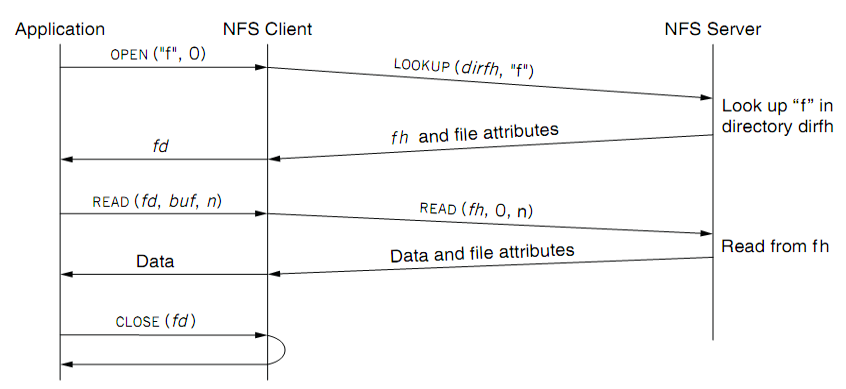
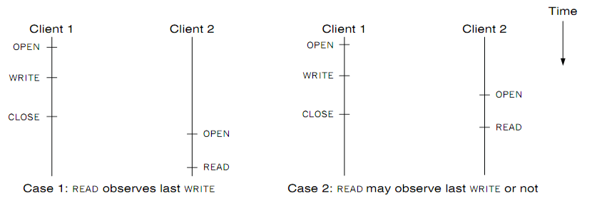
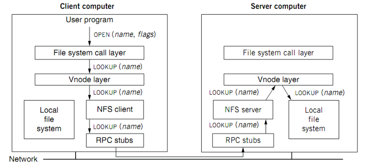

# Word Count with MapReduce

### Train of thought

The purpose of this lab is to implement word count with MapReduce. 

MapReduce is based on distributed system: It need a master to start the MapReduce process, and many distributed unit to do map or reduce work. Also, mappers need to read the content to deal with from some files and store the intermediates into different files, while reducers need to read from those intermediates and do reduce work, and write the output into a file. 

Both mappers and reducers are distributed, so their work must be based on a distributed file system. For google, it is **GFS**, while for this lab, it is the **chfs** we build up in the last lab. 

Notice that the file system we created in the last lab is not a distributed one. So in this lab, we need to implement **RPC** to make it distributed.

It is still very useful to have a good knowledge of the overall structure.

 

In lab1, we have been focusing on building up the basic file system by implementing the **inode manager** and the **chfs client**.

**Inode_manager** is the lowest layer which implement the basic file system based on inode, while **extent_server** is a layer after it, which offers interfaces like get and put. 

The **extent_client** implements **RPC** to call the interfaces provided by **extent_server**.

**chfs_client** makes use of the **extent_client** to offer higher level interfaces like **create**, **mkdir**, etc.

**fuse** makes use of  **chfs_client** to provide interfaces for **Kernel Fuse**, of which **User application** can make use. 

In the main function of **fuse.cc**, the file system will be **mounted**.

### Notice

Notice that all the file I/O will base on RPC, so you should reduce the number of RPC by:

+ Reading all the content from the file.
+ When appending contents to a file, collect all the contents together and then write them.

### RPC(Remote Procedure Call)

#### Overview

RPC, namely remote procedure call, is created to make **distributed** computing look like **centralized** computing.

The goal of RPC is to allow a procedure to execute in another address space without coding the details for the remote interaction.

#### Stub

Both client and server has a structure called **stub**, which encapsulates the code dealing with request and response, making it more like a local function instead of a distributed and remote one. By this kind of encapsulation, the client can call the function (GET_TIME in this case) just like it does locally.

The basic duty of client stub and server stub:

+ **Client stub**

  + Put the arguments into a request

  + Send the request to server

  + Wait for a response

+ **Service stub**
  + Wait for a message.
  + Get the parameters from the request.
  + Call the procedure
  + Put the result into a response
  + Send the response to the client

#### Request/Response

+ Using **marshal** and **unmarshal**, namely serialize and unserialize.

+ Notice that its no use to send references, for the client and server absolutely doesn't share the same memory space. Only sending value make sense.
+ Parameter passing is very challenging, for two machines may have differet:
  + byte ordering (Big endian or Little endian?)
  + sizes of integers and other types(4 bytes or 8 bytes?)
  + floating point representations(It's very common)
  + character sets
  + alignment requirements
  + ......

+ There exists some decoupling factors, client is dependent on server. Once the server interfaces changed and is not compatible with the old one, the client has to change, otherwise it may be unable to work. So we should build systems that are easy to adapt changes. That means the system should be equipped with **backward compatibility** and **forward compatibility**, namely newer and older one can understand each other.

#### Encoding/Decoding

+ Why not using language-specific formats 

  Many languages have built-in support for encoding:

  + Java's java.io.Serializable
  + Python's pickle

  Drawbacks:

  + Tied to a particular programming language. (It's challenging for java to call a C++ server, e.g.)
  + No forward and backward compatibility

+ Standardized encoding: JSON, XML & etc.

  Benefits:

  + Human-readable, easy to debug.

  Drawbacks:

  + Ambiguity around encoding of numbers (12 is uint32? int32? uint64? int64? What about its value changing in the future? Can't determine at all.)

  + How to support **binary strings**? People have to **re-encode** the string as Base64, etc.

  + Verbose: use more bytes to store the data. E.g., <xx> </xx> in XML

+ Using binary formats

  Also it's not so readable, but it can save lots of space, which is very suitable for message metadata in RPC.

  Use **Thrift interface definition language(IDL)** and **Protocol Buffers IDL** to compact space.

#### When RPC meets failure

+ When a client is using RPC to call a function but get no reply, the reason behind it is heterogeneous.

  It could be: 

  + The remote node dumps
  + The response is lost on the internet
  + The remote node is experiencing a pause because of GC
  + etc

+ **At-least-once semantics** & **At-most-once semantics**

+ **Idempotent** & **Non-idempotent** 

  When **at-least-once** is ever **OK**? 

  + if no side effects (e.g., read-only operation) 

  + if app has its own plan for detecting duplication

+ **Implement exactly-once** semantics: 

  + Server remembers the requests it has seen and replies to executed RPCs (across reboots) 

  + **Detect duplicates**, requests need unique IDs (XIDs)

+ This is a **tradeoff**, a server will have to store extra information, thus being stateful.

#### Summary

+ Standards for wire format of RPC message and data types? **IDL**

+ Library of routines to **marshal /** **unmarshal** data

+ Stub generator, or RPC compiler, to produce "stubs"

  + marshal arguments, call, wait, unmarshal reply

  + unmarshal arguments, call real function, marshal reply

  + similar to Web Service based on WSDL

+ Server framework:

  + Dispatch each call message to correct server stub

  + Recall each called functions ,if provide **at-most-once** semantic or **exactly-once semantic** 

+ Client framework:

  + Give each reply to correct waiting thread / callback

  + Retry if timeout or server cache

+ Binding: how does client find the right server? Use **socket** binding. 

### Distributed File System

#### NFS(Network File System)

##### **Design Goals** (by Sun, 1980s, designed for workstations)

+ Any machine can be a client or server

+ Support **diskless** workstations

+ **Heterogeneous** system must be supported. 
  + Different HW, OS, underlying file system
+ Access **transparency** **(just like you are visiting files locally)**
  + Use remote access model 

+ Recovery from **failure**
  + Stateless, UDP, client retries	
+ High **performance**
  + Use caching and read-ahead

##### The api of RPC

+Lookup

-Open/Close

##### Steps

+ Mount:  

  + Server exposes the endpoint

  + Client parses **pathname** and contacts server for file **handle** 
  + Server returns file handle
  + Client creates in-memory **VFS inode** (vnode) at mount point which internally points to remote files

+ Lookup:

  + Client lookup to get handle and attributes of a file, which can be used as the parameter of the other access functions: 
    + e.g., read(handle, offset, count)

+ Application:

  + Application can use traditional unix file api, like open, close, using file descriptor.

+ Overall Description:

  + Application calls traditional unix file api.
  + NFS Client use RPC
  + NFS Server is stateless, while NFS Client is stateful, which stores some metadata of opened files, like the cursor.

  Application calls OPEN, then the NFC Client calls LOOKUP to get the file handle from NFS Server.

  READ and CLOSE is similar to OPEN. But notice that the server doesn't know whether an application has closed a file, for it stores no information about it. Also, the read operation for application is **idempotent**, for the client is **stateful**, which stores information like the **cursor** of an opened file. So,   each time an application call READ/WRITE, if failed, the cursor will not move, thus making each read/write **idempotent**.
  
  NFS Client is in the **kernel** mode.

##### File Handler Structure

File handler contains three parts:

+ **File system identifier**: for server to identify the file system

+ **inode** **number**: for server to locate the file

+ **Generation number**: for server to maintain consistency of a file (Expire)

##### Q & A

+ Why not use path instead of inode number? 

  If someone open a file named file1, while another person renames file1 to file2, and file3 to file1, what will happen?

+ What if a client repeats a request until it receives a reply?

  Server maintains some soft state: reply cache.

+ What about the case of "Delete after open?" (A opens a file, while B delete this file, and logically A should read the content of the old file)

  Server should store more information, it's a **tradeoff**!

##### Improvement

Client: 

+ Cache file data at client (buffer cache)
+ Cache file attribute information at client
+ Cache pathname bindings for faster lookup

Server:

+ Caching is “automatic” via buffer cache

+ All NFS writes are write-through to disk(Flush to disk)

###### But you know, for caching, efficiency and consistence is a tradeoff

**Type-1:** **Read/write coherence**

+ On local file system, **READ** gets newest data

+ On NFS, client has cache

+ **NFS could guarantee read/write coherence for every operation, or just for certain operation**

**Type-2:** **Close-to-open consistency**

+ Higher data rate

+ **GETATTR** when **OPEN**, to get last modification time

+ Compare the time with its cache

+ When **CLOSE**, send cached writes to the server 

**Vnode layer make external files behave like local files.**

##### Validation

When file opened or server contacted for new

+ Compare last modification time

+ If remote is more recent, invalidate cached data

Always **invalidate** data after some time

+ open files (3 sec), directories (30 sec)

If data block is modified, it is:

+ Marked **dirty**, then flushed on file close

##### Improve read performance

+ Read ahead
+ Read large chunck
  + e.g., 8kb

##### Drawbacks

+ **Assumes synchronized clock** **(a** **global** **clock)**
+ **Locking cannot work**
+ **No reference counting of open files** **(stateless** **server)**

#### GFS(Google File System)

### MapReduce

