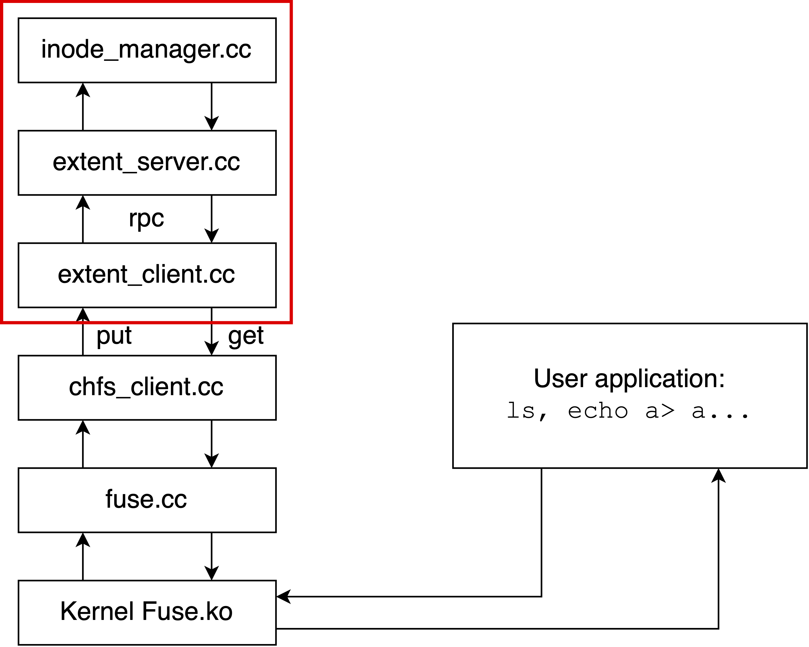
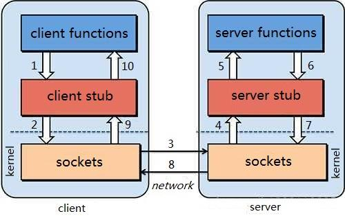

# Word Count with MapReduce

### Train of thought

The purpose of this lab is to implement word count with MapReduce. 

MapReduce is based on distributed system: It need a master to start the MapReduce process, and many distributed unit to do map or reduce work. Also, mappers need to read the content to deal with from some files and store the intermediates into different files, while reducers need to read from those intermediates and do reduce work, and write the output into a file. 

Both mappers and reducers are distributed, so their work must be based on a distributed file system. For google, it is **GFS**, while for this lab, it is the **chfs** we build up in the last lab. 

Notice that the file system we created in the last lab is not a distributed one. So in this lab, we need to implement **RPC** to make it distributed.

It is still very useful to have a good knowledge of the overall structure.

 

In lab1, we have been focusing on building up the basic file system by implementing the **inode manager** and the **chfs client**.

**Inode_manager** is the lowest layer which implement the basic file system based on inode, while **extent_server** is a layer after it, which offers interfaces like get and put. 

The **extent_client** implements **RPC** to call the interfaces provided by **extent_server**.

**chfs_client** makes use of the **extent_client** to offer higher level interfaces like **create**, **mkdir**, etc.

**fuse** makes use of  **chfs_client** to provide interfaces for **Kernel Fuse**, of which **User application** can make use. 

In the main function of **fuse.cc**, the file system will be **mounted**.

### RPC(Remote Procedure Call)

#### Overview

RPC, namely remote procedure call, is created to make **distributed** computing look like **centralized** computing.

The goal of RPC is to allow a procedure to execute in another address space without coding the details for the remote interaction.

#### Stub

Both client and server has a structure called **stub**, which encapsulates the code dealing with request and response, making it more like a local function instead of a distributed and remote one. By this kind of encapsulation, the client can call the function (GET_TIME in this case) just like it does locally.

The basic duty of client stub and server stub:

+ **Client stub**

  + Put the arguments into a request

  + Send the request to server

  + Wait for a response

+ **Service stub**
  + Wait for a message.
  + Get the parameters from the request.
  + Call the procedure
  + Put the result into a response
  + Send the response to the client

#### Request/Response

+ Using **marshall** and **unmarshall**, namely serialize and unserialize.

+ Notice that its no use to send references, for the client and server absolutely doesn't share the same memory space. Only sending value make sense.
+ Parameter passing is very challenging, for two machines may have differet:
  + byte ordering (Big endian or Little endian?)
  + sizes of integers and other types(4 bytes or 8 bytes?)
  + floating point representations(It's very common)
  + character sets
  + alignment requirements
  + ......

+ There exists some decoupling factors, client is dependent on server. Once the server interfaces changed and is not compatible with the old one, the client has to change, otherwise it may be unable to work. So we should build systems that are easy to adapt changes. That means the system should be equipped with **backward compatibility** and **forward compatibility**, namely newer and older one can understand each other.

#### Encoding/Decoding

+ Why not using language-specific formats 

  Many languages have built-in support for encoding:

  + Java's java.io.Serializable
  + Python's pickle

  Drawbacks:

  + Tied to a particular programming language. (It's challenging for java to call a C++ server, e.g.)
  + No forward and backward compatibility

+ Standardized encoding: JSON, XML & etc.

  Benefits:

  + Human-readable, easy to debug.

  Drawbacks:

  + Ambiguity around encoding of numbers (12 is uint32? int32? uint64? int64? What about its value changing in the future? Can't determine at all.)

  + How to support **binary strings**? People have to **re-encode** the string as Base64, etc.

  + Verbose: use more bytes to store the data. E.g., <xx> </xx> in XML

+ Using binary formats

  Also it's not so readable, but it can save lots of space, which is very suitable for message metadata in RPC.

  
